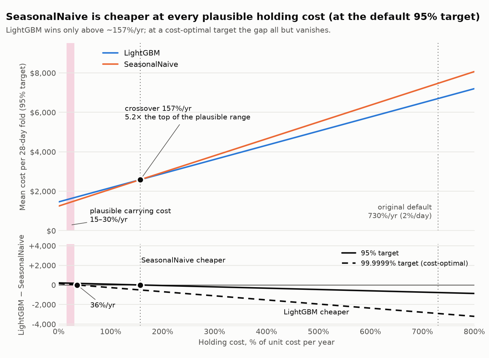
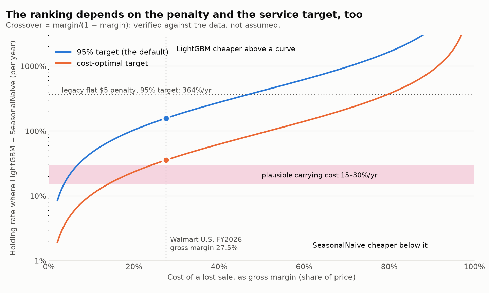
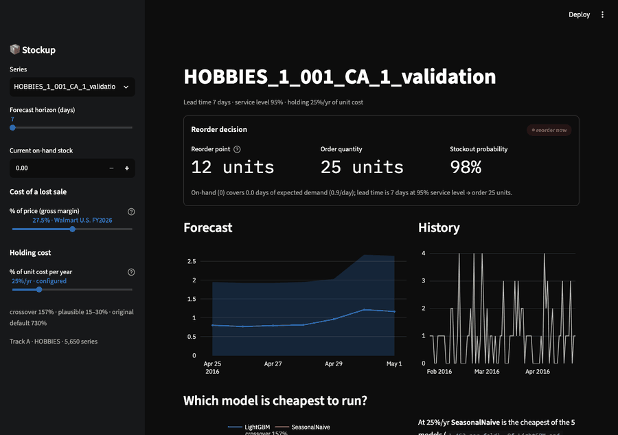

# Stockup

Forecast demand with calibrated uncertainty, then turn the forecast into a **reorder decision**
(how much, when) that minimises stockout plus holding cost — proven against naive baselines in
honest, leakage-free backtests. The output is a reorder table, not a chart.

## The finding

**Which forecasting model is cheapest to run is not a property of the models. It depends on four
things — what it costs to hold stock, what a lost sale costs, the service target, and the ordering
policy — and the answer flips across plausible values of each.** That is the result, and it is
stronger than either headline this project has previously had, not a retreat from them.

**The deeper finding is that `S = s` was the root cause behind that flip, and three earlier results
in this project were unknowingly compensating for it rather than explaining it.** The ~12-point
service gap ("Where it fails") was chased as a safety-stock *sizing* problem and survived two levers
built to close it (empirical residuals, finer pooling) because sizing was never the constraint — the
reorder trigger was: 78% of stockout cycles at 95% were cycles the order would have covered if it had
refilled past `s` (undershoot, not a sizing failure). The volume-quintile calibration scheme's ~9%
cost win — the leading candidate for the shipped default as recently as 2026-09-18 — was compensating
for the same undershoot the same way: re-pooling a buffer the trigger was throwing away. Its own
pre-declared held-out test, re-run under the repaired policy, now fails (cost CI at each scheme's own
chosen target crosses zero on fold 4, −$22 [−$58, +$8], where the pre-fix version had passed cleanly
— [`reports/order_up_to_2026-09-20.md`](reports/order_up_to_2026-09-20.md), section 3). At the same
nominal 95% target it is still a real, if smaller, saving (−$26 [−$58, −$0]) with worse CSL — the win
didn't vanish outright, but the specific test that would justify switching the default to it does not
survive the fix. NBEATS's Phase 7 cost loss is a third candidate for the same cause, still untested:
it was attributed to the model lacking SeasonalNaive's "accidental" forecast-bias cushion, but never
against a policy that gives every model a real, priced buffer instead — queued for the next Bridges-2 run
(`docs/bridges2.md`). Two of three are now confirmed; the third is a stated hypothesis, not yet
evidence. `S > s` closes most, not all, of the service gap itself — 51% of the stockouts remaining
after the fix are still undershoot, so the trigger, not just the lot size, is still leaving service
on the table (see "Where it fails").

**The magnitudes say more than any of the three stories alone: fixing the policy is worth roughly
11× what picking the right model is.** Repairing `S = s` saved **$1,116 per fold** [$576, $1,920] at
the default target — 71% of the original pooled cost. Choosing LightGBM over SeasonalNaive under the
*repaired* policy is worth **$99 per fold** [$34, $160]. The value in this project is in the decision
layer — the ordering policy, the service target, the cost parameters — not in the forecaster; the
model comparison is real, but it is the smaller number by an order of magnitude.

Four reversals came out of the same five models, on the same panel, without retraining anything —
only the policy and the pricing changed underneath them:

| what changed | model that wins on cost |
|---|---|
| Phase 4 original (`S = s`, 2%/day holding) | SeasonalNaive |
| empirical-residual safety-stock sizing | LightGBM |
| realistic holding (25%/yr) + lost-margin pricing | SeasonalNaive |
| `S = s + 2 × lead-time demand`, `lot_multiple = 2` | AutoETS, tied with LightGBM (SeasonalNaive no longer) |

**Why policy dominates: the forecasts behind every flip.** Every reversal in that table is a
contest between SeasonalNaive and the rest, never a contest inside "the rest" — and that split is
exactly what forecast divergence predicts. Pairwise Pearson correlation of the five models' P50
forecasts ([`reports/model_divergence_2026-09-29.md`](reports/model_divergence_2026-09-29.md))
puts five of the six pairs among MovingAverage, AutoETS, AutoTheta and LightGBM above 0.95
(0.953–0.979; MovingAverage–LightGBM, at 0.934, is the exception). That is mostly agreement about
series *level*, not shape — correlated inside each series and averaged it is 0.35–0.76 where it can
be computed at all, and the cluster members' forecasts differ from one another by 19–28% of mean
demand — so the cluster is *similar*, not interchangeable. It is similar enough that the comparison
inside it is small: the $99/fold LightGBM–SeasonalNaive gap under the repaired policy dwarfs
anything measured between LightGBM and the rest of the cluster or the Croston family, all of which
are cost-tied with it under the shipped policy
([`reports/production_model_2026-09-29.md`](reports/production_model_2026-09-29.md)).
SeasonalNaive sits below the line against
every other model (0.655–0.704 pooled, and its forecasts differ from LightGBM's by 96% of their
own mean demand — practically a different forecast, not a noisy copy). **That is the mechanism
behind the table: the four reversals are not close calls resolved by a small policy nudge, they
are a policy repeatedly changing which side of one real forecast difference gets rewarded.** The
~11× magnitude gap is what happens when the one difference that is real (SeasonalNaive vs.
everything else) is worth an order of magnitude less than the policy it is evaluated under — real
differences, but ones that wash out next to the decision layer, not an illusion of difference to
begin with.

Every flip was a decision-layer or parameter change — the sizing formula, the holding rate, or the
ordering policy — never the models. **Under the policy actually shipped, LightGBM beats SeasonalNaive by $99
per fold [$34, $160], and that ordering is robust across the plausible holding-rate range (no
crossover at 15–30%/yr — see below); AutoETS is nominally cheapest of all and is tied with
LightGBM, as is every other model tested (see "Results").** But it is the fourth reversal in a row of the same shape, so the
model-ranking conclusion should be trusted less than the policy-ranking one: three earlier "wins"
already reversed once the decision layer under them changed, and this one is not exempt from that
just because it is the most recent.

**Under the original ordering policy (`S = s`, which every result before 2026-09-20 used), the naive
baseline is cheaper at any realistic carrying cost at the default target, and at the cost-optimal
target the ranking depends on where in the plausible range the true rate falls.** At the default
95% target and the default cost model (holding 25%/yr — the plausible range is roughly 15–30% —
and a lost sale costing Walmart U.S.'s 27.5% gross margin), SeasonalNaive is cheaper than LightGBM
by **$178 per 28-day fold [95% CI $77, $299]**, cheapest of all five; the holding rate at which
LightGBM would catch up is **157%/yr (CI 84–243%), 5.2× the top of the range**. At the
cost-optimal target the crossover falls to **36%/yr [CI 10–73%]** and the gap is +$44 [−$61,
+$205], not distinguishable from zero: LightGBM is cheaper in 10% / 31% / 43% of resamples at
15 / 25 / 30%/yr. That crossover sits at the top edge of the working range and *inside* it if
seasonal obsolescence is counted — the 15–30% figure is a general-goods rate that does not price
markdowns on seasonal stock, and an effective rate more than ~6 points higher puts 36% within
range. Nothing in this repo sizes that, so I state the condition rather than assert either side.

<p align="center">
  
</p>

**Under the repaired policy — an order-up-to level `S = s + Q`, `Q` two lead-times of expected
demand, now the default — the ranking reverses.** `S = s` was a defective policy in this simulator:
an order replaces only the deficit at the moment it is placed, with one order in transit at a time,
so demand arriving during the lead time is not covered until the next order (78% of stockout cycles
at 95% were cycles the reorder point would have covered). Repairing it cuts pooled cost at the
default target from $1,569 to **$453 per fold (−$1,116 [−$1,920, −$576])**, raises fill rate from
81.5% to 97.5%, and moves the cost-optimal target back to 95%. Under it **LightGBM is cheaper than
SeasonalNaive by $99 [$34, $160], with no crossover at any holding rate**: it holds less *and*
stocks out less. SeasonalNaive's edge under `S = s` was buying fewer stockouts with more stock; once
the policy stops losing the demand, the extra stock buys nothing. The gain is not the starting-stock
convention (starting at `s` still gives $491), but it is one simulator, one panel, a baseline that is
weak in a specific way (a stronger `S = s`, with inventory-position triggering, was not tested), and
no ordering cost is priced — see [`reports/order_up_to_2026-09-20.md`](reports/order_up_to_2026-09-20.md).

| ordering policy | service target | crossover holding rate | LightGBM − SeasonalNaive at 25%/yr |
|---|---|---|---|
| `S = s` *(original)* | 95% | **157%/yr** | **+$178 [+$77, +$299]** — SeasonalNaive cheaper |
| `S = s` | 99.9999% (cost-optimal) | **36%/yr** [10–73%] | +$44 [−$61, +$205] — indistinguishable |
| `S = s + 2 × lead-time demand` *(default)* | 95% (also cost-optimal) | none | **−$99 [−$160, −$34]** — LightGBM cheaper |
| `S = s`, flat $5 penalty *(legacy pricing)* | 95% | 364%/yr | +$630 [+$204, +$1,089] |

<p align="center">
  
</p>

Cost is *exactly* linear in the holding rate and in the lost-sale cost (no policy reads either),
so the crossovers are solved, not fitted, and checked three ways
([`reports/holding_breakeven_2026-09-20.md`](reports/holding_breakeven_2026-09-20.md)): the closed
form, an independent root-find (agree to 2e-12), and a full re-simulation under the default
economics (trajectories identical, priced columns reproduced to 6e-14). The penalty sweep is in
[`reports/penalty_sensitivity_2026-09-20.md`](reports/penalty_sensitivity_2026-09-20.md) (all its
numbers are under `S = s`); the target sweep and the stockout-cause decomposition that motivated
fixing the policy are in
[`reports/optimal_target_2026-09-20.md`](reports/optimal_target_2026-09-20.md).

**The argument that survives.** Choosing a model by its effect on the decision rather than by
forecast accuracy is still the right idea, and it still changes the answer under every policy
tested: LightGBM is 4th of 5 on MASE and no accuracy metric predicts where it lands on cost. But a
decision-effect ranking is only as good as the cost structure and the policy it is measured under —
you cannot pick a model by decision effect without knowing both. **This project demonstrates that by
getting it wrong three times in succession, each correction changing the answer again.** The Phase 4
headline ("LightGBM beats the naive baseline on simulated dollars") held up under resampling and was
true only at a holding cost 24× the top of the plausible range (730%/yr). The first correction
stated the crossover crisply — 364%/yr, "12× outside the range" — and was itself an over-claim: it
rested on a second unsourced default, the $5 flat penalty, and a 95% target nobody had chosen.
Interrogating those moved the number to 157%, then to 36% at the cost-optimal target — still outside
the range, but only just, and the third correction found the policy the ranking was measured under
was itself broken, which reversed the sign entirely. Accuracy metrics never ask what things cost or
what policy realises the forecast, which is why they are easy to compute and can be silently
uninformative; a decision-focused project is only as credible as the cost inputs and the operating
policy it can defend. That is the case for Track B (real costs), and for the dashboard sliders below.

> Status: Phase 7 (deep model, stretch) done, plus v1.1's uncertainty work. **Corrected headline,
> twice over:** the Phase 4 claim that LightGBM wins on simulated cost held only under three
> unsourced defaults, and the correction of it held only under a defective ordering policy; the
> Phase 4 write-up below is kept as history, with pointers to both corrections. **The served system
> now sizes safety stock with the same calibrated method the results were measured with, and orders
> up to `s + 2 × lead-time demand` instead of just `s`** (`/reorder`, `make score` and the
> dashboard; it previously used the raw quantile-derived method Phase 4 showed loses, and the `S =
> s` policy shown here to lose on cost — see "Where it fails"). LightGBM is the model served, and
> under the repaired policy it beats SeasonalNaive and is cost-tied with every other model tested. MinTrace reconciliation's item-level gain
> (Phase 5, run on AutoETS, not the production model) does not survive a bootstrap; a FastAPI
> service, batch scoring, Docker image, CI,
> monitoring, and a Streamlit dashboard sit on top of it (Phase 6) — see "Results" and
> [`docs/serving.md`](docs/serving.md).

<p align="center">
  
</p>

The dashboard exposes both unsourced parameters as sliders (sidebar) — the holding rate and the
lost-sale cost — with the crossover, the plausible range and the original 730% default marked on the
same two-line chart, so anyone who opens it can move a parameter and watch the ranking flip. The
model-cost comparison shown there is at `S = s` (the parameter it is teaching; the repaired policy
has no crossover in the plausible range, so there would be nothing to slide toward).

## Why

Most forecasting portfolio projects stop at RMSE on a holdout set. This one goes to the decision
that actually costs money: given a forecast, what do you order, and does that choice beat the
naive policy on simulated dollars, not just accuracy — and, as the finding above shows, under what
cost assumptions.

## Data

- **Track A (public, in this repo):** [M5 Forecasting](https://www.kaggle.com/c/m5-forecasting-accuracy) — Walmart daily unit sales, hierarchical (item × store × dept × category × state).
- **Track B (private):** a real small-business SKU-level sales history, run through the identical
  pipeline via a config switch. Never committed; results reported in aggregate only. The loader
  (`load_track_b`) is implemented and schema-tested against a fixture matching the documented
  contract (`data/track_b/README.md`) — the real export hasn't been provided yet, so there's no
  Track B case study in this README (yet). Everything else in this repo runs on Track A alone.

See [`docs/data.md`](docs/data.md).

## Quickstart

**macOS prerequisite:** `brew install libomp` (LightGBM's OpenMP runtime).

```bash
make setup      # uv sync + pre-commit install
make data       # download and ingest Track A (M5), HOBBIES only — fast day-to-day iteration
make backtest   # rolling-origin backtest, writes reports/backtest_<date>.md
make divergence # are the models actually different? writes reports/model_divergence_<date>.md
make decide     # reorder policy + cost simulation, writes reports/decision_<date>.md
make safety-stock # 2x2 safety-stock calibration ablation, writes reports/safety_stock_<date>.md
make breakeven  # solve the holding rate where LightGBM/SeasonalNaive cost the same; writes the chart
make optimal-target # critical ratio + extended service-target grid; ranking at the cost-optimum
make penalty    # ranking sensitivity to the lost-sale cost and the service target
make croston    # Croston family (Classic/SBA/TSB), accuracy + shipped-policy cost by bucket
make production-model # do LightGBM's quantiles feed sizing? cost vs LightGBM, run cost, coverage
make data-full  # full M5, all 3 categories — needed for reconcile
make reconcile  # hierarchical reconciliation experiment, writes reports/reconciliation_<date>.md
make train      # fit + persist the production LightGBM model and its safety-stock calibration
make calibrate  # refit only the calibration `make serve` sizes with (after a config/lead-time change)
make serve      # FastAPI at :8000 — GET /health, POST /forecast, POST /reorder, GET /metrics
make score      # batch-score every series, writes outputs/reorder_<date>.csv
make dashboard  # Streamlit operator view — history, forecast fan, reorder rec, cost sliders, monitoring
make test       # unit + leakage tests (includes a real end-to-end smoke backtest)
```

`make serve`, `make score` and `make dashboard` need the calibration artifact (`make train` writes it);
without it `/reorder` returns 503 rather than serving the uncalibrated method.

Docker: `make train && docker build -t stockup . && docker run -p 8000:8000 stockup` — see
[`docs/serving.md`](docs/serving.md) for the full walkthrough (including a `curl` example).

## Architecture

```
raw data → ingest → canonical long table → feature pipeline (point-in-time safe)
    → model registry (naive → statistical → Croston family → global LightGBM → [deep])
    → rolling-origin backtester → quantile forecasts (P10/P50/P90)
    → decision layer (reorder point, safety stock, order qty, cost sim)
    → FastAPI + Streamlit, with drift/accuracy monitoring
```

## Results

**Are the models actually different? (v1.1)** — four of the five models below land within 0.01
RMSSE of each other, which on a 77%-zero panel is exactly what you'd expect if they were all
forecasting approximately flat near-zero and the ranking were separating noise. That is worth
testing before presenting any ranking, so it was, with the pass/fail line set in advance:
>0.95 pooled Pearson correlation on every pair of P50 forecast vectors would mean the comparison
isn't measuring anything. Full analysis in
[`reports/model_divergence_2026-09-29.md`](reports/model_divergence_2026-09-29.md).

**5 of 10 pairs clear 0.95 — all five inside the four-model RMSSE cluster; the sixth cluster pair,
MovingAverage–LightGBM, is 0.934.** Every pair involving SeasonalNaive is far below the line
(0.655–0.704), and SeasonalNaive really is a different forecast. So the rankings are not noise, but
three caveats travel with them, and the pooled figure overstates how alike the cluster is:

- Most of that correlation is agreement about *series level*, not forecast shape. Demeaning within
  each series×fold drops the clustered pairs to 0.75–0.91; correlating *inside* each series×fold
  and averaging, so no series' scale can carry it, gives 0.35–0.76 (intermittent series
  0.33–0.72, regular 0.57–0.94) — and only where both forecasts move at all: 48–91% of series×folds
  for the pairs where it is computable, not at all for MovingAverage, whose 28-day forecast is flat
  by construction (AutoETS is flat on half the series).
- **Measured against demand, cluster members differ from one another by 19–28% of mean demand**
  (intermittent series 21–31%, regular 15–24%) — the same measure that puts SeasonalNaive 96% off
  LightGBM (110% intermittent, 76% regular). A real difference, roughly a quarter the size of
  SeasonalNaive's, so "near-interchangeable" overstated it.
- **Across the clustered pairs, the models disagree by only 18–27% of their own mean absolute
  error.** They differ by a fraction of what they are each wrong by — which is the regime where a
  reported 1–4% gap can be sampling noise. Read the small gaps in the tables below with that in
  mind; the confidence intervals that test exactly this are reported below
  ([`reports/model_comparison_ci_2026-09-18.md`](reports/model_comparison_ci_2026-09-18.md)).

**Accuracy (Phases 2–3)** — Track A, HOBBIES category, 400-series subsample, 4 rolling-origin
folds, 28-day horizon. Full table and methodology in
[`reports/backtest_2026-09-10.md`](reports/backtest_2026-09-10.md).

| model | MASE | RMSSE | coverage (nominal 80%) |
|---|---|---|---|
| AutoTheta | 1.524 | 0.822 | 62.9% |
| MovingAverage | 1.530 | 0.820 | 62.2% |
| AutoETS | 1.530 | 0.814 | 63.6% |
| **LightGBM** | **1.587** | 0.823 | **81.2%** |
| SeasonalNaive | 1.633 | 1.088 | 73.2% |

LightGBM beats seasonal naive on MASE in 4/4 folds and is the only model that clears the ±5-point
quantile-coverage bar (81.2% vs. 80% nominal) — the statistical baselines' P10/P90 bands are all
7–18 points too narrow (see the report's "Quantile calibration" section).

**Confidence intervals (v1.1).** Paired bootstrap over series, 2,000 resamples, on per-series
MASE (the recomputed means reproduce the table above exactly). LightGBM minus each baseline:

| vs. | MASE difference | 95% CI | reading |
|---|---|---|---|
| SeasonalNaive | −0.045 | [−0.100, +0.011] | **not distinguishable** at this sample size |
| AutoETS | +0.057 | [+0.034, +0.082] | LightGBM worse |
| AutoTheta | +0.064 | [+0.034, +0.096] | LightGBM worse |
| MovingAverage | +0.057 | [+0.031, +0.087] | LightGBM worse |

So "beats seasonal naive in 4/4 folds" is a fold-level count that does not survive at the series
level: the two are not distinguishable on MASE. What does hold is that LightGBM is *distinguishably
worse* than the three simpler baselines on point accuracy — the 4th-of-5 ranking is real, not noise.

**Decision-layer cost simulation (Phase 4)** — *history: every dollar figure in this section and
the next few was simulated at a holding cost of 2% of unit cost per **day** (730%/yr). The ranking
below does not survive a realistic holding cost; the correction, with the breakeven and the
cost-vs-rate chart, is [at the top of this README](#the-finding) and under "Holding cost" below.*
Same folds/models, run through the newsvendor policy in [`docs/decision.md`](docs/decision.md) and a lost-sales (s, S) inventory simulation.
Full table in [`reports/decision_2026-09-16.md`](reports/decision_2026-09-16.md) (costs are
unchanged from [`decision_2026-09-10.md`](reports/decision_2026-09-10.md) — the v1.1 rerun
reproduces them exactly and adds the cycle-service-level column).

| model | mean total cost / fold | holding cost | stockout cost | fill rate | cycle service level |
|---|---|---|---|---|---|
| **LightGBM** | **$14,543** | $7,225 | $7,318 | 81.5% | 82.6% |
| AutoETS | $14,726 | $7,104 | $7,623 | 80.7% | 81.9% |
| AutoTheta | $14,830 | $7,395 | $7,435 | 81.2% | 82.5% |
| MovingAverage | $14,914 | $7,291 | $7,624 | 80.7% | 82.3% |
| SeasonalNaive | $15,224 | $8,582 | $6,642 | 83.2% | 84.7% |

**Confidence intervals on cost (v1.1)** — paired bootstrap over series, LightGBM minus each other
model, per fold ([`reports/model_comparison_ci_2026-09-18.md`](reports/model_comparison_ci_2026-09-18.md)):

| vs. | cost difference | 95% CI | sign flips | reading |
|---|---|---|---|---|
| SeasonalNaive | −$681 | [−$1,142, −$183] | 0.5% | **LightGBM cheaper** |
| MovingAverage | −$371 | [−$732, −$52] | 1.0% | **LightGBM cheaper** |
| AutoETS | −$183 | [−$453, +$52] | 7.2% | **not distinguishable** |
| AutoTheta | −$287 | [−$599, +$15] | 3.3% | **not distinguishable** |

At 2%/day the claim — LightGBM beats SeasonalNaive on decision cost — survives resampling. Its lead over
AutoETS and AutoTheta does not, and should be read as a tie with them at this sample size, not as a
ranking. Note the mechanism behind the SeasonalNaive win: LightGBM's fill rate is 1.7 points *lower*
(CI [−2.8, −0.6]), so it wins by holding less stock, not by serving more demand. **These intervals
hold at the legacy 2%/day only** — at 25%/yr, 2%/month or 2%/year the sign against SeasonalNaive
reverses (see "Holding cost" below).

**The Croston family (v1.1 Task 4).** The modelling ladder never included the models built for
intermittent demand — the first gap a forecasting specialist would name on a 77%-zero panel.
`CrostonClassic`, `CrostonSBA` and `TSB` (`statsforecast`, same conformal-interval wrapper as the
other statistical baselines) are now in the registry, run through the same backtest and, under the
policy actually shipped (`S = s + 2 × lead-time demand`, 95% target), the same decision-cost
simulation as every other model —
[`reports/croston_2026-09-23.md`](reports/croston_2026-09-23.md). On accuracy they land inside the
existing four-model cluster (TSB best of the three at 1.531 MASE, against AutoTheta 1.524 /
LightGBM 1.587) — the same RMSSE-clustering the divergence analysis above already explains, not a
new effect. On decision cost, all three beat SeasonalNaive with a bootstrap CI excluding zero
(CrostonSBA cheapest at $441/fold vs. SeasonalNaive $526) and none is distinguishable from
LightGBM ($427) — under the shipped policy the family is a real, evidenced alternative to
LightGBM, not a rung that quietly loses. Given the synthesis above (policy dominates model choice
by roughly an order of magnitude), that is closer to the expected outcome than a surprise: the
four models already in the accuracy cluster and the Croston family land in the same place because
the decision layer, not the forecaster, is doing most of the work either way.

**Two service measures (v1.1).** `service_level_target = 0.95` is a *cycle service level* — the
probability of surviving a replenishment cycle without a stockout — while this table has always
reported *fill rate*, the fraction of demand met from stock. Those are different quantities, and a
95% CSL does not imply a 95% fill rate, so the "every model misses the target" claim was worth
re-testing against the measure the policy actually aims at. It survives: realised CSL averages
**82.8%** against fill rate's 81.5%, only 1.3 points apart and both ~12 points short of target.
The policy misses the target it was sized for; this was never a metric mismatch. Details in
[`reports/decision_2026-09-16.md`](reports/decision_2026-09-16.md).

A second, fill-rate-targeted policy is implemented alongside it (size safety stock from the loss
function to hit a target fill rate directly, rather than `z · σ`) — and it does **worse on both
axes**: fill rate 72.7%, cost +15.6%. Its mean safety factor comes out at 1.28 against the CSL
policy's z = 1.64, because at this panel's σ/Q ratio a 95% fill-rate target is the weaker of the
two. The formula promises 95% and the simulation delivers 72.7%.

That 22-point miss comes with a caveat worth stating rather than glossing: `β = 1 − σ_LT·G(k)/Q`
assumes a **fixed lot size** Q, and `S = s` gives it no such thing — realised Q has a coefficient
of variation of 1.59, varying by more than its own mean. So part of that gap is the formula being
misapplied, not evidence about the shape of demand, and the two are not separable from these runs.
The cycle-service-level result above carries no such assumption and remains the primary evidence.

At the 2%/day holding cost, LightGBM wins on cost too — $681/fold (4.5%; 95% CI $183–$1,142)
cheaper than SeasonalNaive — but that wasn't true on the first pass, and the reason why is worth keeping visible rather than quietly fixing and
moving on:

**What went wrong first, and why.** The initial version sized each model's safety stock straight
from its own stated P10/P90 width. That first run had LightGBM *losing* on cost despite winning on
accuracy: its interval was ~18% numerically narrower than SeasonalNaive's, which is enough to
under-provision safety stock even with *better* marginal quantile coverage (81.2% vs. 73.2%) —
because interval width isn't a normalized, cross-model-comparable "uncertainty" unit, it's just
whatever each model's training objective happens to produce. A model didn't have to be wrong to
lose; it only had to be narrower.

**The fix:** size safety stock from each model's own *realised* forecast error (`actual -
predicted`), pooled across ~400 series into two intermittency buckets rather than trusting any
model's self-reported interval — full design and the rejected alternatives in
[`docs/decision.md`](docs/decision.md). Every model's simulated cost went *up* under the fix (the
old method was under-provisioning safety stock across the board, not just for LightGBM).

**The accuracy ranking and the decision-cost ranking disagree — at 2%/day.** LightGBM is 4th of 5
on MASE: distinguishably behind AutoETS, AutoTheta and MovingAverage, and not distinguishable from
SeasonalNaive. At the 2%/day holding cost it also has the lowest simulated cost, and that claim
survives resampling against SeasonalNaive (−$681 per fold, 95% CI [−$1,142, −$183]). This was
written up as the project's thesis ("choosing by decision effect changes the answer"). The
disagreement is real but the cost half of it is not robust: it depends on three parameters, and at
the default cost model and any real carrying cost SeasonalNaive is cheaper (the crossover is 157%/yr;
364%/yr under the legacy flat penalty) — see "Holding cost" below. What survives is the narrower claim that a decision-effect ranking needs the cost structure
it is measured under, which is the argument [at the top](#the-finding).

**Safety-stock calibration: an ablation with confidence intervals (v1.1)** — every model missing
the service target by ~12 points pointed at the safety-stock rule rather than at any one model, and
two separate choices were baked into that rule. They were separated and measured independently, and
every difference carries a paired-bootstrap CI over series (2,000 resamples). Full analysis in
[`reports/safety_stock_2026-09-18.md`](reports/safety_stock_2026-09-18.md).

- **Form** — `z · σ_pooled` (assumes symmetric normal lead-time demand) vs. the residual
  distribution's own quantile at the target level (assumes nothing).
- **Granularity** — the shipped 2 intermittency buckets; *volume terciles within intermittency*
  (renamed from "intermittency × volume": it was meant as 6 buckets but populates only 4, because
  every `regular` series is already in the top volume tercile, so it really just splits the
  intermittent class three ways); and *volume quintiles alone*, a fifth cell — 5 balanced buckets,
  no intermittency dimension.

| form | granularity | mean total cost / fold | vs. shipped (95% CI) | fill rate | cycle service level |
|---|---|---|---|---|---|
| normal | volume quintile | **$13,223** | −$1,624 [−$2,191, −$1,091] | 82.7% | 80.1% |
| normal | volume tercile within intermittency | $13,458 | −$1,389 [−$1,727, −$1,074] | 82.5% | 80.7% |
| empirical | volume tercile within intermittency | $13,548 | −$1,300 [−$1,689, −$938] | 82.2% | 79.8% |
| empirical | intermittency | $14,662 | −$186 [−$324, −$53] | 79.7% | 79.9% |
| normal | intermittency *(shipped)* | $14,848 | — | 81.5% | 82.8% |

**Granularity is the lever; distributional form is not.** Finer pooling cuts cost by ~9–11%, and
every one of those intervals excludes zero. The empirical form alone buys a small real saving ($186,
1.3%) but lowers fill rate; on top of finer pooling it is not distinguishable from `z · σ` (it costs
$89 more, CI [−$3, +$181]). Both diagnostics predicted the granularity result: fill rate falls from
~98% in the lowest volume decile to ~75% in the highest under the shipped scheme, and per-series
residual std spans nearly an order of magnitude *inside* a single bucket (p90/p10 ≈ 8). Pooling a
buffer in absolute units across that spread was the defect.

**The empirical-quantile comparison is underpowered, not lost.** Its bucket estimate's bootstrap CI
spans a median 85% of the estimate itself, against 44% for `z · std` (a standard deviation uses
every observation; a 95th percentile leans on the ~10 above it). That is a statement about data
volume, not about empirical quantiles or the demand distribution: matching the normal form's
precision would take roughly 3.8× as many residuals per bucket (~430 vs. ~113 today, assuming the
usual 1/√n scaling). It is also why "what I'd do with a budget" below spends on more series first.
The fifth cell ties with the tercile scheme (−$235, CI [−$615, +$132]), so volume quintiles are the
cleaner choice, not a demonstrably better one.

**Holding cost: the ranking is a function of it (v1.1).**
`HOLDING_COST_RATE=0.02` entered in the initial commit as an "illustrative" default with no stated
period, and the simulation accrues it per *day* — ~730% of unit cost per year, not a plausible
carrying cost. The safety-stock policy never reads the rate and holding is linear in it, so every
stored run re-prices exactly, and the crossover between LightGBM and SeasonalNaive can be *solved*
rather than sampled. It depends on the cost model, so it is reported below at both: **364%/yr under
the legacy flat $5 penalty, 157%/yr under the default lost-margin economics** (95% CI 84–243%), 12×
and 5.2× the top of the plausible 15–30% range. Derivation, the three-way verification and the
chart: [`reports/holding_breakeven_2026-09-20.md`](reports/holding_breakeven_2026-09-20.md). The
default is now **25%/yr** (0.000685/day), from a named source with named limits — a cross-industry
average, not a retail measurement (`docs/decision.md`, "Holding cost rate"). Re-priced under the
*legacy* flat-$5 model at the legacy value and the two other readings the repo's history left open
([`reports/holding_cost_sensitivity_2026-09-20.md`](reports/holding_cost_sensitivity_2026-09-20.md);
this table varies the holding rate only, so it stays on the pricing the stored runs used):

| | 2%/day *(legacy default)* | 2%/month (~24%/yr) | 2%/year | **25%/yr *(default)*** |
|---|---|---|---|---|
| cheapest model | LightGBM | **SeasonalNaive** | **SeasonalNaive** | **SeasonalNaive** |
| LightGBM − SeasonalNaive (per fold) | −$681 [−$1,142, −$183] | **+$631** [+$205, +$1,091] | **+$673** [+$248, +$1,140] | **+$630** [+$204, +$1,089] |
| cost-minimising nominal target (shipped scheme) | 92% | **≥99.9%** (grid edge) | **≥99.9%** (grid edge) | **≥99.9%** (grid edge) |
| saving from moving to that target | 0.8% | 41% | 45% | 41% |
| volume-quintile − shipped, same 95% target | −$1,624 [−$2,191, −$1,091] | −$538 [−$1,111, −$12] | −$504 [−$1,083, +$28] *(crosses zero)* | −$539 [−$1,112, −$13] |

Three things follow, all under the legacy pricing. **The model cost ranking is not stable across
holding costs** — the headline of this README. At lower holding rates stockouts dominate the total,
and SeasonalNaive stocks out least. **Task 7's "95% is nearly free" holds only at 2%/day:** at any
realistic rate, moving toward the optimum cuts cost by ~41–45%. And realised CSL saturates near 93%
at a 99.9% nominal target, short of the critical ratio those costs imply. An earlier version of this
paragraph read that saturation as evidence for the `S = s` policy structure *from the sweep's grid
edge*; that inference was wrong — the edge was the cost structure — and the subsections below give
the actual evidence. The 25% figure is an assumption; a real holding cost (Track B) replaces it.

**Stockout penalty: from a flat $5 to lost margin (v1.1).** The other unsourced parameter had the
same defect: a flat $5.00 per lost unit against a mean item price of $5.91, i.e. a lost sale priced
at ~85% of the item. What a retailer loses is the margin, so the default is now a lost sale =
**27.5% of price** (Walmart U.S. segment's fiscal-2026 gross profit rate from its 10-K: net sales
$482,975M, gross profit $132,615M — the matching figure, since M5 is Walmart U.S. store data; the
consolidated 24.2% blends in Sam's Club and International and is a sweep point) with stock valued
at cost — a lower bound on a stockout's cost, and not the hobby category
(`docs/decision.md`, "Stockout penalty"). The crossover is exactly proportional to
`margin / (1 − margin)`, so it is swept rather than trusted
([`reports/penalty_sensitivity_2026-09-20.md`](reports/penalty_sensitivity_2026-09-20.md)): 22%/yr at a
5% margin, 132%/yr at the consolidated 24.2%, **157%/yr at the 27.5% default**, 276%/yr at 40%, 2,350%/yr at 85% (≈ the old flat
$5). Every holding-rate figure at the top of this README is at these economics.

**Service target: what the costs call for, and where the ranking goes (v1.1).** 95% was a default,
not a finding, and every ranking here was measured at it
([`reports/optimal_target_2026-09-20.md`](reports/optimal_target_2026-09-20.md)). **This entire
subsection, including every crossover holding rate it names, is measured under `S = s`, superseded
as the default on 2026-09-20 — see "The finding" for the policy that replaced it, which has no
crossover in the plausible range at any target.**
- **The implied optimum.** The newsvendor critical ratio `Cu / (Cu + Co)` is **98.8%** under the
  default economics (lead time as the protection period; 98.4% with the measured 9-day cycle) and
  99.4% under the legacy flat $5 at mean price, 99.6% for the median SKU. 95% was not close.
- **The grid edge was the cost structure.** The earlier sweeps stopped at 99.9%, where pooled cost
  was still 12% above its minimum. With the grid extended to 99.9999%, cost keeps falling to
  99.999% (within 2% of the minimum from there) and is at its minimum at the top of the grid,
  99.9999% (z = 4.75) — the optimum is "at least 99.999%", not a sharp point (at the 24.2% margin
  it was interior at 99.999%). Pooled cost falls from $1,569 to $949 per fold (−40%) between 95%
  and there.
- **It is not a target to ship, because realised service does not follow.** Realised cycle service
  tops out at 96.8% at 99.9999% nominal and never reaches the critical ratio. Classifying every
  stockout cycle (replicating the simulator's cycle logic; counts match the stored run exactly):
  at 95% nominal **78%** of stockout cycles are cases where lead-time demand was *below* the reorder
  point and the order had triggered with on-hand already dipped under it; at 99.9999% it is **92%**.
  Only 0.24% of cycles are genuine sizing failures. So the direct evidence that the `S = s`
  structure limits service is this decomposition, not the grid edge: a wider buffer only pays for
  what the trigger loses. The extreme nominal optimum is a symptom.
- **The ranking depends on the target.** At 95%, SeasonalNaive beats LightGBM by $178 [$77, $299].
  At the cost-optimal target the gap is +$44 [−$61, +$205] and every LightGBM difference from the
  other four crosses zero; the point-estimate order of the statistical baselines changes (AutoTheta
  first, SeasonalNaive third), and the crossover holding rate falls to 36%/yr. **Model choice
  depends on the service target as well as the holding rate** — and LightGBM is last of five in
  point estimate at every target tested.

**Is 97% a real finding? Held-out validation (v1.1).** The ~97% target was first picked by
sweeping the same four folds it was reported on. Re-done properly
([`reports/holdout_target_2026-09-20.md`](reports/holdout_target_2026-09-20.md)): the target is
chosen on folds 1–3 only — smallest target at which the quintile scheme's CSL matches the shipped
scheme's at 95% — giving **97%**, the same value picked at every walk-forward step. On the held-out
fold 4, quintile at 97% vs. shipped at 95%: cost **−$2,039** [−$2,868, −$1,265] per fold at 2%/day
(**−$1,960** [−$2,841, −$1,152] at the 25%/yr default, −$1,960 and −$1,957 at the other readings; re-run under the default lost-margin economics:
**−$460** [−$873, −$174]), CSL +2.1 pts [+0.2, +4.0], fill rate +4.7 pts [+2.8, +6.9]. All three pre-registered criteria pass. Three qualifications: at the plausible holding rates
roughly 40% (held-out) to 55% (in-sample) of that saving is the higher target rather than the
scheme (carrying more stock is cheap there); the "optimum is stable" criterion is vacuous at those rates, where both optima are the
grid edge; and one window's bootstrap says nothing about window-to-window variation — the
walk-forward shows a saving in all three out-of-sample windows, but CSL −1.5 pts in one of them.

**The CSL "regression" was an artefact of comparing at the same nominal target.** At an identical
95% target the quintile scheme lowers CSL by 2.7 points (CI [−4.1, −1.3]) while cutting cost, which
looks impossible in a simulation that prices stockouts. Along one scheme's target axis it is
impossible; across schemes it is not, because CSL counts every replenishment cycle equally while
cost counts lost units and their price. At matched realised service the finer scheme is cheaper, no
worse on CSL and better on fill rate (in-sample: −$1,629 [−$2,247, −$1,079], CSL +0.7 pts [−0.6,
+2.1], fill +3.3 pts [+1.9, +4.9]).

**The default switch: unblocked, evidence supports it, not flipped (v1.1).** The scheme switch was
held until serving used calibrated sizing and the model comparison had been re-run at the
cost-optimal target; both have landed. The case for the volume-quintile calibration stands and is
stronger than when it was made: both cost components fall under it, and the held-out fold-4 saving
passes every pre-registered criterion at 25%/yr under the legacy pricing (−$1,960 [−$2,841,
−$1,152]) *and* under the default lost-margin economics (−$460 [−$873, −$174], CSL +2.1 pts
[+0.2, +4.0]). Two things keep it from being a config flip. (a) The target is still undecided —
97% was chosen to match the shipped scheme's service, it is not a cost optimum, and the cost optimum
is an artefact of the undershoot above. (b) The "shipped scheme" is now one constant,
`safety_stock.DEFAULT_SCHEME`, that the harness *and* serving both read, but the older analyses
compare "finer schemes vs the shipped one" against `BASELINE_CELL`, which would then be comparing
the quintile scheme with itself; flipping means giving them a fixed legacy reference, refitting the
production calibration (`make calibrate`, ~10 minutes) and restating the tables that name the
shipped scheme. That is a contained change and it is next; it also matters less than the `S > s`
policy below, which addresses the cause of the service gap rather than re-pooling the buffer.

**Neither lever closes the nominal service gap, and the reason is now measured.** With both the
residual distribution's shape and its pooling granularity ruled out as the binding constraint, the
stockout-cycle decomposition above shows why: most stockouts happen in cycles the reorder point
would have covered, because an `(s, S = s)` order triggers with on-hand already below s. At the
legacy 2%/day the shipped policy's ~83% realised CSL is close to the cost-optimal level for that
cost model; under any realistic cost it is far from it. See "What I'd do with a budget".

**Hierarchical reconciliation (Phase 5)** — full M5 ingested (30,490 series, all 3 categories,
kept off the memory-safe path via parquet predicate pushdown), scoped to a 6,098-series hierarchy
(2 stores, one per state, full category/department tree under each), 400-series bottom-level
subsample. Bottom-up and MinTrace via `hierarchicalforecast`, AutoETS as the base model
(LightGBM's price/calendar features don't have a sensible definition for a synthetic node like
"all of California"). Full table in
[`reports/reconciliation_2026-09-07.md`](reports/reconciliation_2026-09-07.md).

| level | base MASE | BottomUp | MinTrace |
|---|---|---|---|
| state | 0.747 | 0.774 (+3.6%) | 0.755 (+1.1%) |
| category | 0.794 | 0.804 (+1.3%) | 0.794 (+0.1%) |
| department | 0.849 | 0.856 (+0.9%) | 0.848 (**-0.1%**) |
| item (bottom) | 1.329 | 1.329 (0.0%) | 1.327 (**-0.1%**) |

**Naive BottomUp reconciliation is not recommended here** — it underperforms the unreconciled
base forecast at every aggregate level, because it's just a sum of noisy bottom-level (item ×
store) forecasts, and those are much noisier than a directly-fit aggregate (MASE 1.33 vs. 0.75).
**MinTrace's apparent gain does not survive a bootstrap.** At the item level (400 nodes) it is
−0.12% with a paired-bootstrap 95% CI of [−0.24%, +0.07%] — **not distinguishable from zero**
([`reports/reconciliation_ci_2026-09-18.md`](reports/reconciliation_ci_2026-09-18.md)). The
department, category and state levels have 14, 6 and 2 nodes; resampling those is not inference, so
the earlier "−0.10% at department" and the aggregate-level differences are point estimates that
cannot be tested this way. BottomUp is worse than the base forecast at every aggregate level in this
run (+0.9% to +3.6%), which is consistent with theory but, for the same reason, is a point estimate
and not a tested claim. Also worth stating plainly: this ran on AutoETS, not the production model,
so it says nothing about LightGBM either way.

**Serving (Phase 6)** — the pipeline is now a running service, not just a report generator:
`reorderpoint/train.py` persists the production LightGBM model; `serve.py` exposes it as a FastAPI
app (`/health`, `/forecast`, `/reorder`, `/metrics`) and a `make score` batch job sharing the same
decision logic; a Dockerfile packages it (image doesn't train on boot — see docs/serving.md);
`.github/workflows/ci.yml` runs lint + the full test suite (including a real, not mocked,
end-to-end smoke backtest) on every push; `monitor.py` provides rolling-MASE error-spike detection
and input-drift detection (verified against a synthetically drifted series in
`tests/test_monitor.py`); and a Streamlit dashboard (`make dashboard`) gives an operator a
per-series view: history, forecast fan, reorder recommendation, latest backtest/decision report
headlines, and a live drift check against the panel's own history. Forward-looking exog data
(future price/events, which no real system feeds this project) is a disclosed proxy documented in
`docs/serving.md`, not a hidden assumption.

**Deep model on Bridges-2 (Phase 7, stretch)** — an N-BEATS model (`neuralforecast`), trained on
a PSC Bridges-2 V100 GPU in fp16 (V100/Volta doesn't support bf16 tensor cores or FlashAttention
properly, so both are avoided entirely — verified against the real hardware before writing the
integration, see [`docs/bridges2.md`](docs/bridges2.md)), same 400-series/4-fold setup as every
earlier phase for a direct comparison. Full tables in
[`reports/backtest_deep_2026-09-10.md`](reports/backtest_deep_2026-09-10.md) and
[`reports/decision_deep_2026-09-10.md`](reports/decision_deep_2026-09-10.md).

| model | MASE | coverage (nominal 80%) | mean total cost / fold | fill rate |
|---|---|---|---|---|
| **NBEATS** | **1.108** | **84.5%** | $17,209 | 71.5% |
| LightGBM | 1.587 | 81.2% | **$14,543** | 81.5% |
| SeasonalNaive | 1.633 | 73.2% | $15,224 | 83.2% |

NBEATS is the most accurate model in the whole project by a wide margin — better MASE than
LightGBM, and the only model besides LightGBM to clear the coverage bar. It also **loses badly on
decision cost** (at 2%/day): 18% more expensive than LightGBM, 13% more expensive than plain
SeasonalNaive — and worse than both at every holding rate (at 25%/yr: $11,453 vs. $7,565 and $6,936).
Per this project's own Phase 7 acceptance bar ("keep only if it wins on decision cost"), **NBEATS
is not adopted** — LightGBM stays the production model. Worth being direct about this rather than
quietly shelving the result: the headline model of the "stretch" phase lost, and that's the more
useful finding, not a disappointing one.

**Why it loses, and what it reveals.** The holding/stockout split is the tell: NBEATS holds 30%
less inventory and stocks out far more than SeasonalNaive (fill rate 71.5% vs. 83.2%). This is the
same directional pattern as Phase 4's original LightGBM finding — a more accurate model ending up
*leaner*, not more conservative — but it happened even with the empirical-residual safety-stock
fix already in place, which was built specifically to prevent that class of bug. The likely
mechanism this time is different: on a 77%-zero-sale-day panel, seasonal naive repeats last week's
value forward, so any series with a recent nonzero sale gets that value echoed across the whole
horizon — inflating its average forecast (and thus its reorder point) in a way that shows up as
*worse accuracy* but functions as an *unpriced safety margin* against demand spikes. NBEATS, being
more accurate, doesn't carry that accidental cushion. And it's not NBEATS-specific: fill rate
across every model this project has evaluated — LightGBM 81.5%, AutoETS 80.7%, AutoTheta 81.2%,
MovingAverage 80.7%, SeasonalNaive 83.2%, NBEATS 71.5% — falls short of the 95% service-level
target (and v1.1 confirmed the same shortfall on cycle service level, the measure the policy
actually targets — see "Two service measures" above). That every model misses, in a narrow band except for the most accurate one, points to the
decision layer's safety-stock formula itself: a symmetric normal approximation (`z · σ`) built
from empirical residual variance likely understates the true risk of a right-skewed, spiky demand
distribution, regardless of how accurately σ is measured. A skewed or empirical-quantile-based
safety-stock formula, rather than the current normal approximation, is the natural next step —
flagged here as a real, evidence-backed limitation rather than fixed under time pressure to force
a cleaner headline number.

**Also a scoping note, not just a result:** this NBEATS integration is univariate — no calendar,
price, or SNAP features, unlike LightGBM's feature pipeline. Extending it to consume the same
exogenous signals is a real feature-engineering project of its own, deliberately out of scope for
a stretch phase (see `docs/bridges2.md`). Some of the accuracy gap, and possibly some of the cost
gap, could reflect that feature disparity rather than architecture alone.

## Ablations

One lever changed at a time, each measured on the real 400-series/4-fold backtest — not a priori
guesses.

| what changed | before | after | effect |
|---|---|---|---|
| Safety-stock sizing: model's own P10/P90 width → empirical realised-residual std | LightGBM $13,199/fold, SeasonalNaive $11,978/fold — **LightGBM loses** despite winning on accuracy | LightGBM $14,543/fold, SeasonalNaive $15,224/fold — **LightGBM wins** (at 2%/day) | Every model's cost rose (the old method under-provisioned safety stock across the board), but the ranking flipped to match accuracy — the fix, not a coincidence |
| LightGBM quantile nominal alpha: 0.10/0.90 → 0.13/0.87 | 85.6% coverage (misses the ±5-point bar around 80% nominal) | 81.2% coverage (clears it) | MASE unchanged — this was purely a P10/P90 spread fix, diagnosed from the miscalibration's direction, not a blind sweep |
| Hierarchical reconciliation: none → BottomUp | item MASE 1.329 (base) | 1.329 (BottomUp, +0.0%) at the bottom, but **+0.9% to +3.6% worse** at every aggregate level above it | A naive sum of noisy bottom-level forecasts inherits their noise going up the tree — not recommended |
| Hierarchical reconciliation: none → MinTrace | same base | item level **−0.12%, 95% CI [−0.24%, +0.07%]** — crosses zero; the other levels have 2–14 nodes and cannot be bootstrapped | **Not distinguishable from no effect** at the only level that can be tested |
| Model family: per-series statistical (AutoETS/AutoTheta) → global LightGBM | best baseline MASE 1.529 (AutoTheta), all baselines miss the coverage bar by 12-22 points | LightGBM MASE 1.587 (only 4% worse) but the *only* model clearing the coverage bar (81.2%) | Global model wins on the metric that actually matters for the decision layer, not the one that looks best in isolation |
| Architecture: global LightGBM (featured) → NBEATS (univariate deep) | LightGBM MASE 1.587, $14,543/fold | NBEATS MASE 1.108 (best in the project), $17,209/fold (worst at the decision layer) | The sharpest accuracy/cost split in the project — see Phase 7 above |
| Ordering policy: `S = s` → `S = s + 2 × lead-time demand` | $1,569/fold pooled, 82.8% realised CSL, SeasonalNaive cheapest, LightGBM $178 costlier | $453/fold pooled (−71%), 91.9% realised CSL, AutoETS nominally cheapest and tied with LightGBM, which is $99 cheaper than SeasonalNaive, no holding-rate crossover in the plausible range | The single largest effect measured in this project, and it reverses the model ranking — see "The finding" |

## Where it fails

- **The served system did not use the sizing method every cost result here was measured with —
  fixed, with limits.** `/reorder`, `make score` and the dashboard called
  `decision.compute_decisions`, which sized safety stock as `z · σ` with σ read off the model's
  *own* P10/P90 width — the method Phase 4 showed loses (see "What went wrong first"). The
  backtest harness sizes from the model's realised forecast residuals, pooled into buckets. The
  served model is LightGBM, whose interval was ~18% narrower than SeasonalNaive's, so it is the model
  that method under-provisions most: on the real model and full 5,650-series panel the raw buffer
  averaged **3.1 units against 6.2 calibrated (2.0×; the calibrated buffer was larger for 93% of
  series, median 2.9×)**. Every cost, service-level and ranking figure in this README came from the
  calibrated harness, so none of it described the running system, and the demo recording still shows
  the uncalibrated path. Serving now applies a persisted calibration (`reorderpoint/calibration.py`,
  written by `make train`/`make calibrate`) through the same sizing function the harness calls, and
  refuses to serve without one (503, not a fallback); `tests/test_serving_calibration.py` pins the
  two paths to the same reorder point for the same series and forecast. Not fixed: the calibration is
  one held-out lead-time window (one residual per series, pooled into two buckets) fitted with the
  proxy future-exog serving uses, and it goes stale as the model does; and no live outcome feed
  exists, so the *realised* service of the running system is unmeasured — only its sizing is
  verified equal to the harness's.
- **The model cost ranking depends on the ordering policy, not just the cost parameters and
  target — and this was found by accident, not by design.** Under the `S = s` policy every backtest
  before 2026-09-20 used, LightGBM is not significantly the cheapest model at any plausible
  combination of cost parameters and target: at the default economics and 95% target SeasonalNaive
  is cheaper by $178 per fold [$77, $299], cheapest of all five, crossover 157%/yr; at the
  cost-optimal target the two are indistinguishable (+$44 [−$61, +$205]), crossover 36%/yr; under
  the legacy flat $5 it was 364%/yr. Under the repaired `S = s + 2 × lead-time demand` policy
  LightGBM is cheaper by $99 [$34, $160] with no crossover in any plausible range. Both are real
  findings about the same models on the same panel; neither is "the" answer, because the answer is
  a function of the policy. LightGBM's lead over AutoTheta is not distinguishable at any rate under
  `S = s`; NBEATS is worse than SeasonalNaive at every rate tested (point estimates — no per-series
  data to bootstrap, and not re-run under the new policy). LightGBM is still what is served, but
  the original reason, its calibrated intervals, no longer supports the *reorder decision*: its
  native P10/P90 feed no part of it (sizing is the P50 lead-time mean plus a buffer from pooled
  empirical residuals; scrambling every model's P10/P90 leaves reorder points, order-up-to levels
  and cost identical to the last bit). On cost it is tied with every RMSSE-cluster member and the
  Croston family under the shipped policy — all six paired-bootstrap CIs contain zero, pooled and by
  intermittency bucket — and beats only SeasonalNaive
  ([`reports/production_model_2026-09-29.md`](reports/production_model_2026-09-29.md)). What its
  intervals are still used for is display (`/forecast`, the dashboard fan chart), where its 81%
  P10–P90 coverage against 59–64% for the alternatives is the one remaining difference. On
  operational grounds alone (seconds to fit, no feature or forward-exog pipeline, no 110 MB
  artifact, no leakage surface) a Croston-family model would be simpler to serve; whether to switch
  is an open decision, not one made here. Every figure is
  conditional on the two cost parameters (holding rate: named source, not retail-specific; lost
  margin: Walmart U.S., a lower bound), the service target, and the ordering policy — see "The
  finding".
- **Intermittent demand is the hard case, consistently.** Series with >50% zero-sale training days
  score far worse than the rest under every model tested: AutoTheta (Phase 2) MASE 1.612 vs. 0.777;
  NBEATS (Phase 7) 1.150 vs. 0.732. This is the central justification for LightGBM's Tweedie
  objective over continuing with per-series statistical methods, and it never fully goes away.
- **New items are common, not an edge case.** 3,056 of 5,650 series (54%) have their first nonzero
  sale more than 90 days into the panel (`reports/eda.md`) — genuine cold-start series the model
  has to handle as a matter of course, not a rare exception worth a footnote.
- **No model hits the stated service-level target under `S = s` — mostly fixed by the policy
  change, not the safety-stock formula.** At 95% nominal the shipped `(s, S = s)` policy realises
  82.8% cycle service level against a 98.8% critical ratio, and even at 99.9999% nominal it caps
  near 96.8%; every model this project has evaluated at the decision layer falls short on fill rate
  too (LightGBM 81.5%, AutoETS 80.7%, AutoTheta 81.2%, MovingAverage 80.7%, SeasonalNaive 83.2%,
  NBEATS 71.5%). The reproducible check in `optimal_target.scheme_saturation` confirms every
  safety-stock scheme (finer pooling, the empirical quantile form) saturates in the same 94–97.6%
  band — the *formula* is not the constraint. The cause is the `(s, S = s)` trigger: 78% of
  stockout cycles at 95% are cycles the reorder point would have covered
  (`optimal_target.stockout_decomposition`, verified against the stored simulation exactly).
  `S = s + 2 × lead-time demand` raises realised CSL to 91.9% at 95% nominal and fill rate to
  97.5% — most of the gap, not all: 51% of its remaining stockouts are still undershoot, so the
  trigger itself (not just the lot size) is still leaving service on the table. The
  fill-rate-vs-CSL formula mismatch discussed below (a fixed-Q formula against a variable-Q policy)
  is now a smaller share of the story than it looked before the decomposition existed.
- **`y` is a demand proxy, not demand.** Units sold under-counts true demand whenever a SKU was
  actually out of stock (stockout censoring) — no correction is applied in v1 (`docs/data.md`).
  Every accuracy and cost number in this README inherits that limitation.
- **The M5 subset is HOBBIES only, not the full catalog.** Headline numbers come from a
  400-series sample of the HOBBIES category specifically (chosen as the smallest of M5's three
  top-level categories, for fast local iteration) — Phase 5's reconciliation experiment is the only
  place the full 30,490-series, 3-category panel gets exercised.

## What I'd do with a budget

- **Replace the assumed cost parameters with real ones.** Both are now assumptions with a named
  source rather than illustrative defaults — holding 25%/yr (a cross-industry average) and a lost
  sale at Walmart U.S.'s 27.5% gross margin (right retailer, not the hobby category, a lower bound) — and the
  ranking is swept against both (`reports/penalty_sensitivity_*.md`). Unit cost is still a price
  proxy. Track B's real carrying cost, lost-sale margin (plus whatever a lost customer costs) and
  COGS settle them. It costs nothing to do and everything trading holding against stockout — the
  ranking, the cost-optimal service level, the size of the calibration-scheme saving — depends on
  them.
- **Lot sizing: done for `S = s + Q`; an inventory-position trigger and a real EOQ are what's left.**
  `reorderpoint/order_up_to.py` confirmed the diagnosis (78% of stockout cycles at 95% were
  undershoot, not sizing failures) and fixed it: `S = s + 2 × lead-time demand` cuts pooled cost by
  71% at the default target and reverses the model ranking (see "The finding"). What it does not
  do: no fixed cost per order is priced, so the multiple was chosen for service, not as an EOQ —
  Track B's real ordering cost would tell you if 2× under- or over-shoots the economic lot; and the
  trigger itself is untouched (`on_hand < s`, one order at a time), so an inventory-position
  trigger that counts stock already on order might close more of the residual 51% undershoot share
  than a bigger `Q` does.
- **More series per calibration bucket, before a fancier safety-stock form.** The empirical-quantile
  comparison is underpowered, not lost: its bucket estimate needs ~3.8× the residuals it has (~430
  vs. ~113) to match the precision of `z · σ`. That is a data-volume problem, so it is solved by
  more series (the full 5,650-series HOBBIES panel rather than the 400-series sample), not by a
  different estimator.
- **Per-series NBEATS results, so NBEATS-vs-LightGBM can get a CI** — folded into the *next*
  Bridges-2 run, not worth GPU time on its own. Phase 7's NBEATS numbers are aggregate tables only
  (the per-series detail was discarded on the cluster); `run_deep_backtest.py` now saves it, so any
  future run recovers it for free.
- **A per-SKU service target from the critical ratio,** instead of one uniform 95%. At the legacy
  2%/day the critical ratio spans ~68% to ~97% across SKUs with price, so a uniform target is wrong
  for most; at the 25%/yr default it is ≥98.4% for nearly all (p10 0.984), and the per-SKU case
  largely disappears. Revisit with Track B's costs, and validate on a fresh time window.
- **Exogenous features for NBEATS.** The Phase 7 comparison is confounded by feature richness, not
  just architecture — LightGBM sees price/calendar/SNAP, NBEATS sees none. `neuralforecast`
  supports `futr_exog_list`/`hist_exog_list`; wiring the same feature set in would make the
  accuracy/cost comparison a cleaner test of architecture alone.
- **The full M5 catalog, not just HOBBIES.** Would need either more RAM (this dev machine caps out
  around 8.6GB — the full panel's 58M rows is a real memory ceiling, worked around in Phase 5 via
  parquet predicate pushdown rather than loading it all at once) or a cloud instance, which
  conflicts with the zero-cost constraint this project holds to by design. A modest paid tier (or a
  larger free-tier instance) would remove that ceiling.
- **The official M5 WRMSSE**, not this project's simplified single-level revenue-weighted RMSSE —
  the full 12-level hierarchical metric is real machinery in its own right, natural to build out
  alongside a genuine Phase 5 hierarchy rather than the smallest 2-store slice used here.
- **Direct multi-horizon training for LightGBM**, instead of the current recursive rollout (predict
  day 1, feed it back as day 2's lag feature, and so on) — would remove the compounding-error
  property recursive forecasting has, at the cost of an expanded training set (28x rows, one per
  origin/horizon-step pair).
- **A real demand-censoring correction.** `y` (units sold) under-counts true demand during
  stockouts; Track B's `on_hand` field, once available, could support inferring when that's
  happening and correcting for it — not attempted in v1.
