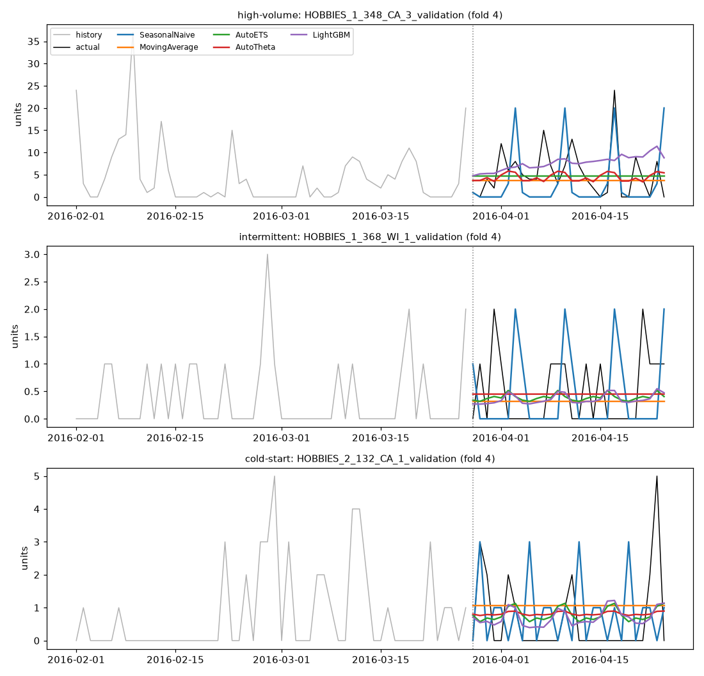

# Model divergence — 2026-09-15

Are the backtest's models producing meaningfully different forecasts, or is the accuracy/cost ranking separating near-identical outputs? Same sample (400 series, seed=0), same 4 folds, same 28-day horizon and models as `reports/backtest_2026-09-10.md`. P50 forecasts only. Mean realised demand in the test windows: 0.705 units/day.

The forecasts are regenerated here rather than reused, so they were checked back against the published report: mean MASE/RMSSE per model reproduce `reports/backtest_2026-09-10.md` to three decimals.

## What this measures, and what it found

**5 of 10 model pairs exceed the 0.95 pooled Pearson threshold** this analysis set in advance as the line for "the comparison isn't measuring anything."

The models are **not** collectively interchangeable. The pairs above the line (MovingAverage/AutoETS, MovingAverage/AutoTheta, AutoETS/AutoTheta, AutoETS/LightGBM, AutoTheta/LightGBM) are exactly the models that cluster on RMSSE; the pairs below it all involve SeasonalNaive, which is genuinely a different forecast (lowest: SeasonalNaive/MovingAverage at 0.655).

Three qualifications keep this from being a clean all-clear:

1. **A high pooled correlation is partly an artifact.** Pooling across series means any two models that agree which SKUs sell more will correlate well. Demeaning within each series×fold drops these same above-the-line pairs to 0.75–0.91 where it is defined at all — and it is undefined for MovingAverage, whose forecast is flat across the horizon by construction, so two of the five vanish entirely. Most of the agreement is about series *level*, not shape.
2. **The disagreements are small next to the errors.** Across the correlated pairs, mean |P50_a − P50_b| runs 18%–27% of those models' own mean absolute error. They differ by a fraction of what they are each wrong by, which is the regime where a 1–4% gap in a headline metric can easily be sampling noise. That is a direct argument for putting confidence intervals on every comparison, not for abandoning the comparison.
3. **Per-series, the forecasts genuinely do differ.** Only 0.1% of series×folds have every pair within 5% on the 28-day total, though 67.1% have at least one such pair. Interchangeability is a property of particular pairs on particular series, not of the model set.

**Conclusion: the comparisons stand, with a caveat.** The ranking separates real differences in forecast, so the accuracy and cost tables are not pure noise. But the four clustered models make forecasts far more similar to each other than to their own errors, so small reported gaps between them should not be read as rankings until they survive a significance test.

## Pooled, all series

Correlation columns: `pooled` = raw P50 vectors (dominated by between-series volume differences); `series_level` = 28-day mean per series×fold; `within_series` = demeaned per series×fold, i.e. agreement on day-to-day shape (blank where a model's forecast is flat by construction). `frac_of_mean_demand` = mean |P50_a − P50_b| ÷ mean demand; `frac_of_pair_mae` = the same difference ÷ the two models' mean absolute error.

| model_a | model_b | pearson_pooled | spearman_pooled | pearson_series_level | spearman_series_level | pearson_within_series | frac_of_mean_demand | frac_of_pair_mae |
| --- | --- | --- | --- | --- | --- | --- | --- | --- |
| SeasonalNaive | MovingAverage | 0.655 | 0.523 | 0.936 | 0.847 | — | 0.954 | 0.861 |
| SeasonalNaive | AutoETS | 0.686 | 0.521 | 0.939 | 0.836 | 0.281 | 0.944 | 0.854 |
| SeasonalNaive | AutoTheta | 0.704 | 0.562 | 0.977 | 0.933 | 0.235 | 0.907 | 0.820 |
| SeasonalNaive | LightGBM | 0.682 | 0.519 | 0.930 | 0.832 | 0.282 | 0.964 | 0.867 |
| MovingAverage | AutoETS | 0.959 | 0.943 | 0.988 | 0.957 | — | 0.204 | 0.201 |
| MovingAverage | AutoTheta | 0.954 | 0.946 | 0.982 | 0.962 | — | 0.215 | 0.211 |
| MovingAverage | LightGBM | 0.934 | 0.908 | 0.974 | 0.935 | — | 0.276 | 0.268 |
| AutoETS | AutoTheta | 0.979 | 0.938 | 0.983 | 0.945 | 0.905 | 0.188 | 0.185 |
| AutoETS | LightGBM | 0.962 | 0.919 | 0.978 | 0.952 | 0.766 | 0.232 | 0.227 |
| AutoTheta | LightGBM | 0.953 | 0.894 | 0.969 | 0.928 | 0.752 | 0.276 | 0.269 |

## Series whose 28-day forecasts are within 5%

|A − B| ÷ mean(A, B) on each series×fold's 28-day P50 total; two all-zero forecasts count as identical.

| model_a | model_b | frac_series_within_5pct |
| --- | --- | --- |
| SeasonalNaive | MovingAverage | 0.159 |
| SeasonalNaive | AutoETS | 0.064 |
| SeasonalNaive | AutoTheta | 0.096 |
| SeasonalNaive | LightGBM | 0.054 |
| MovingAverage | AutoETS | 0.146 |
| MovingAverage | AutoTheta | 0.134 |
| MovingAverage | LightGBM | 0.098 |
| AutoETS | AutoTheta | 0.163 |
| AutoETS | LightGBM | 0.130 |
| AutoTheta | LightGBM | 0.108 |

- Every pair within 5%: **0.1%** of 1600 series×folds.
- At least one pair within 5%: **67.1%**.

## By intermittency bucket

### intermittent (>50% zero training days: True; n = 1440 series×folds)

| model_a | model_b | pearson_pooled | spearman_pooled | pearson_series_level | pearson_within_series | frac_of_mean_demand | frac_of_pair_mae |
| --- | --- | --- | --- | --- | --- | --- | --- |
| SeasonalNaive | MovingAverage | 0.577 | 0.461 | 0.907 | — | 1.083 | 0.875 |
| SeasonalNaive | AutoETS | 0.596 | 0.461 | 0.917 | 0.164 | 1.079 | 0.874 |
| SeasonalNaive | AutoTheta | 0.620 | 0.508 | 0.965 | 0.121 | 1.031 | 0.836 |
| SeasonalNaive | LightGBM | 0.589 | 0.458 | 0.912 | 0.140 | 1.103 | 0.887 |
| MovingAverage | AutoETS | 0.964 | 0.935 | 0.978 | — | 0.210 | 0.180 |
| MovingAverage | AutoTheta | 0.968 | 0.937 | 0.974 | — | 0.219 | 0.188 |
| MovingAverage | LightGBM | 0.932 | 0.883 | 0.959 | — | 0.302 | 0.256 |
| AutoETS | AutoTheta | 0.971 | 0.926 | 0.977 | 0.721 | 0.214 | 0.184 |
| AutoETS | LightGBM | 0.945 | 0.902 | 0.968 | 0.453 | 0.253 | 0.215 |
| AutoTheta | LightGBM | 0.937 | 0.870 | 0.958 | 0.414 | 0.308 | 0.262 |

All pairs within 5% on 28-day totals: 0.1%; at least one pair: 65.6%.

### regular (>50% zero training days: False; n = 160 series×folds)

| model_a | model_b | pearson_pooled | spearman_pooled | pearson_series_level | pearson_within_series | frac_of_mean_demand | frac_of_pair_mae |
| --- | --- | --- | --- | --- | --- | --- | --- |
| SeasonalNaive | MovingAverage | 0.584 | 0.599 | 0.911 | — | 0.770 | 0.832 |
| SeasonalNaive | AutoETS | 0.634 | 0.603 | 0.912 | 0.325 | 0.750 | 0.815 |
| SeasonalNaive | AutoTheta | 0.657 | 0.629 | 0.969 | 0.276 | 0.729 | 0.789 |
| SeasonalNaive | LightGBM | 0.630 | 0.586 | 0.899 | 0.332 | 0.764 | 0.828 |
| MovingAverage | AutoETS | 0.927 | 0.953 | 0.984 | — | 0.197 | 0.244 |
| MovingAverage | AutoTheta | 0.917 | 0.948 | 0.974 | — | 0.210 | 0.259 |
| MovingAverage | LightGBM | 0.892 | 0.948 | 0.965 | — | 0.238 | 0.294 |
| AutoETS | AutoTheta | 0.969 | 0.966 | 0.975 | 0.925 | 0.150 | 0.187 |
| AutoETS | LightGBM | 0.946 | 0.947 | 0.968 | 0.804 | 0.202 | 0.252 |
| AutoTheta | LightGBM | 0.933 | 0.935 | 0.955 | 0.786 | 0.229 | 0.284 |

All pairs within 5% on 28-day totals: 0.0%; at least one pair: 81.2%.

## Representative series

Last fold, 56 days of history then the 28-day test window. This is the whole finding in one picture: SeasonalNaive is the only model that moves day to day (it echoes last week forward), while the other four are near-flat lines separated mainly by level. That is what a 0.93–0.98 pooled correlation with an undefined within-series shape correlation looks like.
