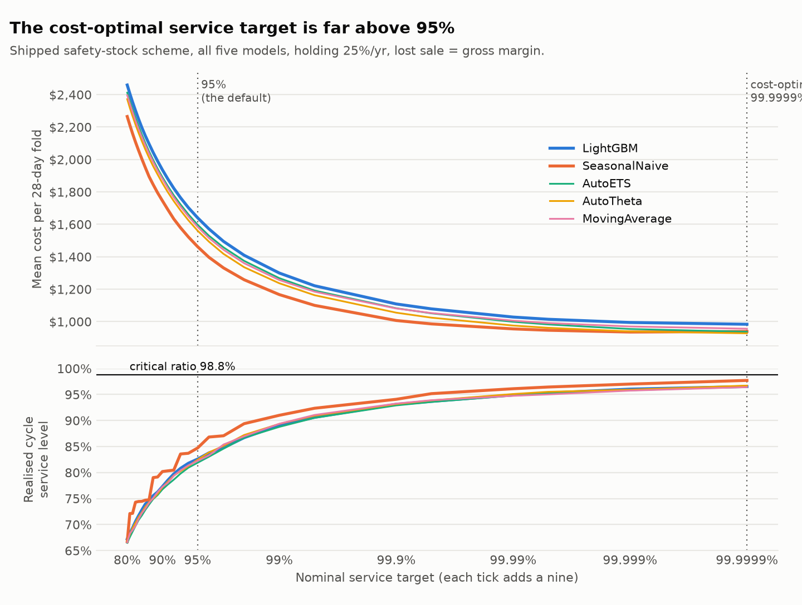

# The cost-optimal service target, and the model ranking there — 2026-09-20

Holding 25%/yr; lost sale = 27.5% gross margin, stock valued at cost (`docs/decision.md`). Shipped safety-stock scheme, all five models, 400 series x 4 folds, the nominal-target grid extended from 99.9% to 99.9999%. Costs are means per 28-day fold; CIs are paired bootstrap over series (2,000 resamples).

## 1. The implied optimum (critical ratio)

`CR = Cu / (Cu + Co)`, `Cu` the per-unit lost-sale cost, `Co = rate x unit cost x period`. It is the cycle service level that minimises expected cost. Mean training-window price $5.91; measured mean replenishment cycle 9.0 days.

| pricing | protection period | CR at mean price | CR p10 | CR median | CR p90 |
| --- | --- | --- | --- | --- | --- |
| unit economics (lost margin) | lead time (7d) | 98.75% | 98.75% | 98.75% | 98.75% |
| unit economics (lost margin) | measured cycle (9.0d) | 98.39% | 98.39% | 98.39% | 98.39% |
| legacy flat $5.00/unit | lead time (7d) | 99.44% | 98.79% | 99.60% | 99.93% |
| legacy flat $5.00/unit | measured cycle (9.0d) | 99.27% | 98.44% | 99.49% | 99.91% |

**The implied optimal service level is ~98.8% under unit economics** (higher, ~99.4% at mean price, under the legacy flat $5 — where the median SKU sits at 99.6% — a ~99.6% figure describes that SKU, not the mean price). 95% was not close to either. Because Co scales with price and so does Cu under unit economics, the ratio no longer varies across SKUs there (the p10/p90 columns collapse) — a uniform target is exactly right under that cost model, which the flat penalty had made look wrong.

## 2. Where the sweep's optimum is, on the extended grid

| nominal target | z | mean cost / fold | holding | stockout | realised CSL | fill rate |
| --- | --- | --- | --- | --- | --- | --- |
| 90.0000% | 1.28 | $1,861 | $149 | $1,712 | 77.7% | 77.9% |
| 95.0000% | 1.64 | $1,569 | $187 | $1,382 | 82.8% | 81.5% |
| 99.0000% | 2.33 | $1,245 | $260 | $986 | 89.5% | 86.2% |
| 99.9000% | 3.09 | $1,067 | $344 | $723 | 93.3% | 89.9% |
| 99.9900% | 3.72 | $992 | $414 | $578 | 95.1% | 92.0% |
| 99.9990% | 4.26 | $959 | $476 | $483 | 96.1% | 93.5% |
| 99.9999% | 4.75 | $949 | $531 | $418 | 96.8% | 94.5% |

Cost-minimising nominal target (pooled over the five models): **99.9999%**, still at the grid edge; the curve is within 2% of that minimum from 99.9990% nominal, so the optimum is 'at least this high' rather than a sharp point. Realised CSL at the minimum is 96.8% against a critical ratio of 98.8%. **No grid target reaches the critical ratio: realised CSL tops out at 96.8%** even at 99.9999% nominal.

Per model:

| model | cost-optimal nominal target | cost at optimum | realised CSL there |
| --- | --- | --- | --- |
| LightGBM | 99.9999% (grid edge) | $983 | 96.5% |
| SeasonalNaive | 99.9990% | $935 | 97.0% |
| AutoETS | 99.9999% (grid edge) | $937 | 96.5% |
| AutoTheta | 99.9999% (grid edge) | $928 | 96.7% |
| MovingAverage | 99.9999% (grid edge) | $956 | 96.4% |

## 3. Does the ranking survive at the optimum?

Mean cost per fold and rank, by nominal target:

| model | 90.0000% | 95.0000% | 99.0000% | 99.9000% | 99.9999% |
| --- | --- | --- | --- | --- | --- |
| LightGBM | $1,936 | $1,640 | $1,299 | $1,108 | $983 |
| SeasonalNaive | $1,745 | $1,462 | $1,166 | $1,007 | $939 |
| AutoETS | $1,890 | $1,597 | $1,268 | $1,082 | $937 |
| AutoTheta | $1,854 | $1,561 | $1,236 | $1,055 | $928 |
| MovingAverage | $1,880 | $1,584 | $1,256 | $1,081 | $956 |

| model | 90.0000% | 95.0000% | 99.0000% | 99.9000% | 99.9999% |
| --- | --- | --- | --- | --- | --- |
| LightGBM | 5 | 5 | 5 | 5 | 5 |
| SeasonalNaive | 1 | 1 | 1 | 1 | 3 |
| AutoETS | 4 | 4 | 4 | 4 | 2 |
| AutoTheta | 2 | 2 | 2 | 2 | 1 |
| MovingAverage | 3 | 3 | 3 | 3 | 4 |

LightGBM minus each other model (negative = LightGBM cheaper), paired bootstrap:

| LightGBM minus | at 95% | at 99.9999% (optimum) |
| --- | --- | --- |
| SeasonalNaive | +178 [+77, +299] | +44 [-61, +205] — crosses zero |
| AutoETS | +43 [-37, +143] — crosses zero | +46 [-3, +127] — crosses zero |
| AutoTheta | +80 [-22, +211] — crosses zero | +56 [-21, +178] — crosses zero |
| MovingAverage | +56 [-16, +153] — crosses zero | +27 [-23, +103] — crosses zero |

The LightGBM/SeasonalNaive comparison keeps its sign from 95% (+178) to the optimum (+44), and the interval at the optimum crosses zero.

Under the legacy flat $5 penalty the optimum is 99.9999% (grid edge), and LightGBM minus SeasonalNaive there is +503 [+201, +864].

## 4. Why realised service saturates below the critical ratio

The earlier sweeps stopped at 99.9%, where pooled cost was still 12% above its minimum: the edge they hit was the cost structure (a lost sale that dwarfs carrying a unit), not the policy. Realised service topping out *below* the critical ratio is a separate fact and needs its own explanation. Every stockout cycle across all models, folds and series is classified below (replicating the simulation's cycle logic; the replicated cycle and stockout counts equal the stored ones exactly):

| nominal target | cycles | stockout cycles | demand exceeded s (sizing) | demand <= s, on-hand < demand (undershoot) | CSL if only sizing failed |
| --- | --- | --- | --- | --- | --- |
| 95.0000% | 18,470 | 3,186 | 699 (22%) | 2,487 (78%) | 96.22% |
| 99.9999% | 18,480 | 599 | 45 (8%) | 554 (92%) | 99.76% |

An order triggers when on-hand falls *below* s, so the stock held when it is placed is below s, and under `S = s` it replaces only that deficit with one order in transit at a time. Most stockout cycles are cycles where the buffer *would* have covered lead-time demand — a wider buffer buys little against them, which is why realised service saturates near 97% however high the nominal target goes. That the *formula* is not the constraint is checked directly below; that the *policy structure* is, is tested by changing it in `reorderpoint/order_up_to.py`. The cost-optimal *nominal* target (99.9999%, z = 4.75) is a symptom of paying for buffer to compensate, not a target anyone should ship.

Realised service by safety-stock scheme (`S = s`; `scheme_saturation`, reproducible with `make optimal-target`) — does a better sizing formula lift the ceiling?

| scheme | target | realised CSL | fill rate |
| --- | --- | --- | --- |
| normal × intermittency | 99.0000% | 89.5% | 86.2% |
| normal × intermittency | 99.9900% | 95.1% | 92.0% |
| normal × intermittency | 99.9999% | 96.8% | 94.5% |
| normal × volume_quintile | 99.0000% | 88.5% | 88.0% |
| normal × volume_quintile | 99.9900% | 95.6% | 93.8% |
| normal × volume_quintile | 99.9999% | 97.6% | 96.1% |
| empirical × intermittency | 99.0000% | 93.3% | 89.3% |
| empirical × intermittency | 99.9900% | 96.6% | 93.1% |
| empirical × intermittency | 99.9999% | 96.6% | 93.1% |
| empirical × volume_tercile_within_intermittency | 99.0000% | 90.7% | 89.9% |
| empirical × volume_tercile_within_intermittency | 99.9900% | 93.8% | 92.1% |
| empirical × volume_tercile_within_intermittency | 99.9999% | 93.8% | 92.1% |

Every scheme is capped: at 99.9999% nominal the best realised CSL is 97.6% and the worst 93.8%. (The empirical form cannot exceed what its largest calibration residual covers, so it plateaus by construction; finer pooling helps a little.)
