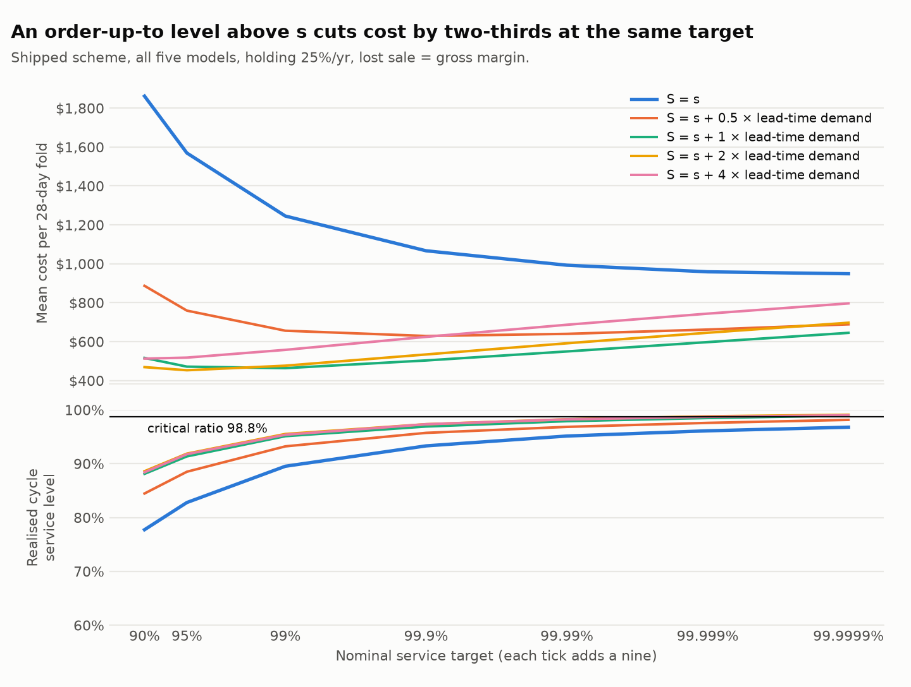

# An order-up-to level above s — 2026-09-20

`S = s + Q`, `Q` a multiple of each series' expected lead-time demand (0 = the original `S = s`). Shipped scheme, all five models, 400 series x 4 folds, holding 25%/yr, lost sale = 27.5% of price. Costs are means per 28-day fold; CIs are paired bootstrap over series (2,000 resamples). `module docstring` fixes the decision rules before the results were read.

## 1. What the order-up-to level does

| lot multiple | target | nominal | cost / fold | vs S=s | realised CSL | fill | undershoot share | orders / fold |
| --- | --- | --- | --- | --- | --- | --- | --- | --- |
| 0.0 | 95% | 95.0000% | $1,569 | — | 82.8% | 81.5% | 78% | 1,239 |
| 0.0 | cost-optimal | 99.9999% | $949 | — | 96.8% | 94.5% | 92% | 1,240 |
| 0.5 | 95% | 95.0000% | $759 | $-810 [$-1,388, $-411] | 88.5% | 91.6% | 68% | 1,174 |
| 0.5 | cost-optimal | 99.9000% | $629 | $-320 [$-635, $-133] | 95.7% | 96.0% | 78% | 1,175 |
| 1.0 | 95% | 95.0000% | $471 | $-1,098 [$-1,906, $-555] | 91.3% | 95.7% | 54% | 987 |
| 1.0 | cost-optimal | 99.0000% | $464 | $-485 [$-966, $-200] | 95.1% | 97.2% | 57% | 987 |
| 2.0 | 95% | 95.0000% | $453 | $-1,116 [$-1,920, $-576] | 91.9% | 97.5% | 51% | 674 |
| 2.0 | cost-optimal | 95.0000% | $453 | $-496 [$-965, $-215] | 91.9% | 97.5% | 51% | 674 |
| 4.0 | 95% | 95.0000% | $518 | $-1,051 [$-1,832, $-531] | 91.8% | 98.2% | 49% | 421 |
| 4.0 | cost-optimal | 90.0000% | $513 | $-436 [$-888, $-171] | 88.4% | 97.7% | 47% | 420 |

`undershoot share` is the fraction of stockout cycles where lead-time demand stayed at or below the reorder point s — inventory was below s when it mattered — from replicating the simulator's cycle logic (replicated cycle and stockout counts equal the stored ones exactly, or the run aborts). Under `S = s` it is 78% at 95% and 92% at that policy's cost-optimal target; under `S = s + 2 x lead-time demand` it is 51% at 95% and 51% at that policy's optimum. It moves, but not to zero: about half of the remaining stockout cycles are still ones the reorder point would have covered — consistent with an order still triggering on a day's overshoot below s whatever the lot size, though this report does not isolate that.

**Lot multiple chosen by the pre-declared rule:** 2 — lot multiple 2 is cheapest and its CI against S = s excludes zero.

**Was that selected and scored on the same folds?** Yes — `choose_multiple` reads its cost and its CI against `S = s` off `pc`/`p`, which cover all four folds. Re-running the same rule on folds 1-3 only, then scoring the chosen multiple's cost against `S = s` on held-out fold 4 (each at its own train-chosen cost-optimal target, 95.0000% vs 99.9999%): folds 1-3 choose **2** ($-497 [$-1,002, $-197]), and on fold 4 alone that choice is cheaper than `S = s` by $-491 [$-867, $-239] — the selection holds up on data it never saw. Is 2.0 an interior minimum of the sweep, or a grid-edge artefact? It is interior: cost at its own optimum is $949 (x0), $629 (x0.5), $464 (x1), $453 (x2), $513 (x4) — 2.0 is lower than both its neighbours (1.0 and 4.0), not the edge of the {0, 0.5, 1, 2, 4} grid tested.

How large is `Q` in EOQ terms? The ordering cost `K` under which each multiple is the EOQ (not priced by the simulation, which charges a lot for the stock it carries and credits it only for the service it buys):

| lot multiple | median Q (units) | median implied K ($/order) |
| --- | --- | --- |
| 0.0 | 0.0 | — |
| 0.5 | 1.2 | $0.00 |
| 1.0 | 2.3 | $0.02 |
| 2.0 | 4.6 | $0.06 |
| 4.0 | 9.3 | $0.25 |

## 2. Does the model ranking survive the policy change?

| lot multiple | target | cheapest | LightGBM rank | LightGBM − SeasonalNaive |
| --- | --- | --- | --- | --- |
| 0.0 | 95% (95.0000%) | SeasonalNaive | 5 | $+178 [$+77, $+299] |
| 0.0 | cost-optimal (99.9999%) | AutoTheta | 5 | $+44 [$-61, $+205] — crosses zero |
| 1.0 | 95% (95.0000%) | LightGBM | 1 | $-109 [$-179, $-50] |
| 1.0 | cost-optimal (99.0000%) | AutoETS | 2 | $-92 [$-149, $-42] |
| 2.0 | 95% (95.0000%) | AutoETS | 2 | $-99 [$-160, $-34] |
| 2.0 | cost-optimal (95.0000%) | AutoETS | 2 | $-99 [$-160, $-34] |

**How much of this is the starting stock?** A 28-day window with `Q` a couple of weeks of demand holds only a cycle or two, and a policy that starts higher in its cycle starts with more stock. The sweep starts each series at `s + Q/2`, the steady-state average. Re-run at the default target from `s` (0), `s + Q/2` (0.5) and `S` (1), priced identically:

| lot multiple | start | cost / fold | realised CSL | fill |
| --- | --- | --- | --- | --- |
| 0.0 | s (= S = s) | $1,569 | 82.8% | 81.5% |
| 1.0 | s + 0 x Q | $512 | 90.9% | 94.9% |
| 1.0 | s + 0.5 x Q | $471 | 91.3% | 95.7% |
| 1.0 | s + 1 x Q | $479 | 90.8% | 96.2% |
| 2.0 | s + 0 x Q | $491 | 91.8% | 96.6% |
| 2.0 | s + 0.5 x Q | $453 | 91.9% | 97.5% |
| 2.0 | s + 1 x Q | $485 | 91.4% | 97.9% |
| 4.0 | s + 0 x Q | $593 | 91.3% | 97.5% |
| 4.0 | s + 0.5 x Q | $518 | 91.8% | 98.2% |
| 4.0 | s + 1 x Q | $646 | 88.2% | 98.8% |

The holding-rate crossover between LightGBM and SeasonalNaive, per policy (default economics; `LGB cheaper @` is the share of bootstrap resamples in which LightGBM is cheaper at 15 / 25 / 30%/yr, the plausible range):

| policy | target | crossover | cheaper below it | crossover 95% CI | resamples with no crossover | LGB cheaper @ 15/25/30% | LGB − SN @25%/yr |
| --- | --- | --- | --- | --- | --- | --- | --- |
| S = s | 95% (95.0000%) | 157%/yr | SeasonalNaive | [84%, 243%] | 0% | 0% / 0% / 0% | +178 |
| S = s | cost-optimal (99.9999%) | 36%/yr | SeasonalNaive | [10%, 73%] | 0% | 10% / 31% / 43% | +44 |
| S = s + 2 x lead-time demand | 95% (95.0000%) | none | — | — | 98% | 100% / 100% / 100% | -99 |
| S = s + 2 x lead-time demand | cost-optimal (95.0000%) | none | — | — | 98% | 100% / 100% / 100% | -99 |

## 3. The scheme comparison, re-run under the new policy

Volume-quintile minus shipped scheme, all folds (paired bootstrap; negative = quintile cheaper):

| lot multiple | comparison | targets (quintile / shipped) | cost | CSL (pts) |
| --- | --- | --- | --- | --- |
| 0.0 | same nominal 95% | 95.0000% / 95.0000% | $-129 [$-432, $+72] — crosses zero | -2.7 [-4.1, -1.3] |
| 0.0 | each at its own optimum | 99.9999% / 99.9999% | $-344 [$-773, $-97] | +0.8 [+0.0, +1.7] |
| 0.5 | same nominal 95% | 95.0000% / 95.0000% | $-79 [$-238, $+29] — crosses zero | -2.4 [-3.6, -1.1] |
| 0.5 | each at its own optimum | 99.9000% / 99.9000% | $-167 [$-326, $-68] | +0.5 [-0.5, +1.5] — crosses zero |
| 1.0 | same nominal 95% | 95.0000% / 95.0000% | $-20 [$-64, $+16] — crosses zero | -2.1 [-3.3, -0.9] |
| 1.0 | each at its own optimum | 99.0000% / 99.0000% | $-56 [$-94, $-26] | -0.6 [-1.6, +0.4] — crosses zero |
| 2.0 | same nominal 95% | 95.0000% / 95.0000% | $-26 [$-58, $-0] | -2.4 [-3.7, -1.0] |
| 2.0 | each at its own optimum | 99.0000% / 95.0000% | $-29 [$-65, $+1] — crosses zero | +2.9 [+1.7, +4.2] |
| 4.0 | same nominal 95% | 95.0000% / 95.0000% | $-24 [$-48, $-3] | -3.1 [-4.5, -1.6] |
| 4.0 | each at its own optimum | 95.0000% / 90.0000% | $-18 [$-47, $+5] — crosses zero | +0.3 [-1.2, +1.9] — crosses zero |

Pre-declared held-out test (each scheme's target chosen on folds 1-3, scored on fold 4):

| policy | targets chosen on folds 1-3 (quintile / shipped) | held-out cost | held-out CSL (pts) | same-95% cost, all folds | criteria 1 / 2 / 3 |
| --- | --- | --- | --- | --- | --- |
| S = s | 99.9999% / 99.9999% | $-342 [$-711, $-109] | +1.6 [+0.4, +2.9] | $-129 [$-432, $+72] — crosses zero | pass / pass / pass |
| S = s + 2 x lead-time demand | 99.0000% / 95.0000% | $-22 [$-58, $+8] — crosses zero | +4.9 [+3.1, +7.0] | $-26 [$-58, $-0] | **fail** / pass / pass |

**The criteria do not all pass under the chosen policy: the shipped scheme is kept.** (Check: `lot multiple 0` reproduces the earlier target sweep to 3.4e-13.)
