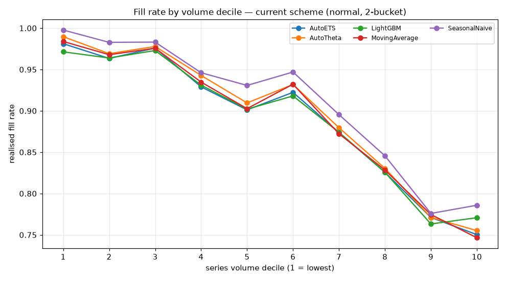

# Safety-stock calibration: 2x2 ablation — 2026-09-16

Two independent levers behind the decision layer's safety stock, measured separately and together. Same folds, models, sample and simulation as `reports/decision_<date>.md`; the only thing that varies is how a bucket of forecast residuals becomes a buffer.

- **Form** — `normal`: `z · σ_pooled`, assuming symmetric normal lead-time demand. `empirical`: the residual distribution's own quantile at the target service level, assuming nothing about its shape.
- **Granularity** — `intermittency`: the current 2 buckets. `intermittency_volume`: crossed with volume terciles, 6 buckets.

Target service level 95%. Cost, fill rate and CSL are means across folds and models.

## The 2x2

| form | granularity | mean_total_cost | holding_cost | stockout_cost | fill_rate | cycle_service_level |
| --- | --- | --- | --- | --- | --- | --- |
| normal | intermittency_volume | 13458.397 | 6547.431 | 6910.966 | 0.825 | 0.807 |
| empirical | intermittency_volume | 13547.512 | 6509.163 | 7038.350 | 0.822 | 0.798 |
| empirical | intermittency | 14662.064 | 6660.203 | 8001.861 | 0.797 | 0.799 |
| normal | intermittency | 14847.658 | 7519.438 | 7328.219 | 0.815 | 0.828 |

Baseline (the shipped scheme) is **normal × intermittency**: $14,848 per fold, fill rate 81.5%, CSL 82.8%. Best cell by cost is **normal × intermittency_volume** at $13,458 (-9.4%), fill rate 82.5%, CSL 80.7%.

## Per model

| form | granularity | model | total_cost | fill_rate | cycle_service_level |
| --- | --- | --- | --- | --- | --- |
| empirical | intermittency | AutoETS | 14513.106 | 0.796 | 0.786 |
| empirical | intermittency | AutoTheta | 14667.442 | 0.790 | 0.788 |
| empirical | intermittency | LightGBM | 14489.054 | 0.797 | 0.796 |
| empirical | intermittency | MovingAverage | 14628.474 | 0.798 | 0.796 |
| empirical | intermittency | SeasonalNaive | 15012.245 | 0.806 | 0.831 |
| empirical | intermittency_volume | AutoETS | 13423.458 | 0.826 | 0.797 |
| empirical | intermittency_volume | AutoTheta | 13593.011 | 0.819 | 0.792 |
| empirical | intermittency_volume | LightGBM | 13467.373 | 0.816 | 0.779 |
| empirical | intermittency_volume | MovingAverage | 13597.637 | 0.821 | 0.792 |
| empirical | intermittency_volume | SeasonalNaive | 13656.082 | 0.828 | 0.828 |
| normal | intermittency | AutoETS | 14726.361 | 0.807 | 0.819 |
| normal | intermittency | AutoTheta | 14830.457 | 0.812 | 0.825 |
| normal | intermittency | LightGBM | 14543.379 | 0.815 | 0.826 |
| normal | intermittency | MovingAverage | 14914.193 | 0.807 | 0.823 |
| normal | intermittency | SeasonalNaive | 15223.897 | 0.832 | 0.847 |
| normal | intermittency_volume | AutoETS | 13424.307 | 0.817 | 0.794 |
| normal | intermittency_volume | AutoTheta | 13455.045 | 0.823 | 0.802 |
| normal | intermittency_volume | LightGBM | 13216.660 | 0.823 | 0.795 |
| normal | intermittency_volume | MovingAverage | 13573.600 | 0.818 | 0.808 |
| normal | intermittency_volume | SeasonalNaive | 13622.374 | 0.845 | 0.836 |

## Can the buckets support the estimate?

The constraint named up front: ~400 residuals per fold, split two ways, leaves ~200 per bucket — a 95% quantile then rests on ~10 tail observations, and a six-way split was expected to cut that to ~3. It turned out less severe than that (the six-way split only populates four buckets — see below), but still thin. Each bucket's statistic carries a bootstrap CI (2,000 resamples) on the quantile itself so the thinness is visible rather than implied.

Median bucket sizes and CI widths (CI width as a fraction of the point estimate):

| form | granularity | median_n | min_n | median_ci_width_frac | max_ci_width_frac |
| --- | --- | --- | --- | --- | --- |
| empirical | intermittency | 200.000 | 40.000 | 0.859 | 2.664 |
| empirical | intermittency_volume | 113.000 | 40.000 | 0.851 | 2.664 |
| normal | intermittency | 200.000 | 40.000 | 0.480 | 0.963 |
| normal | intermittency_volume | 113.000 | 40.000 | 0.437 | 0.963 |

**The 6-bucket scheme only ever populates 4 buckets, not 6.** Intermittency and volume are close to the same variable on this panel: every one of the ~42 `regular` series lands in the top volume tercile, so `regular_lo` and `regular_mid` are empty and the `regular` class is never actually subdivided. What lever B really does here is split the *intermittent* class three ways by volume — which is worth knowing before reading its effect as 'finer pooling in general'.

The empirical quantile's CI spans a median 85% of the estimate itself at the finer granularity and 86% at the coarser one — the split barely moves it, because the binding constraint is the *tail* count, and the smallest bucket (40 residuals) is the same `regular` group in both. What does move is the **form**: the same buckets sized by `z · std` carry a median CI of 44%, roughly half as wide, because a standard deviation uses every observation while a 95th percentile leans on the handful above it.

**A CI spanning 85% of its own point estimate is not a buffer anyone should trust to two significant figures.** The empirical cells below are real measurements and are reported as such, but the estimator is roughly twice as noisy as the one it was meant to replace, which is a substantive part of why it does not win. More buckets cannot fix that; more series per bucket could.

## Diagnostic 1 — fill rate against volume decile

Run on the current scheme (normal × intermittency). If pooling in absolute units is what depresses service, fill rate should fall as volume rises: the same buffer in units covers a low-volume SKU comfortably and a high-volume one barely.

Pooled across models, fill rate declines from 97.7% in the bottom three volume deciles to 78.8% in the top three. A declining relationship is the signature of pooling in absolute units: one buffer in units is generous for a low-volume SKU and thin for a high-volume one.

## Diagnostic 2 — within-bucket dispersion of per-series residual std

If a single bucket spans an order of magnitude in per-series residual std, pooling it into one absolute buffer is indefensible regardless of what the cost table says.

| bucket | n | p10 | median | p90 | max | p90_over_p10 |
| --- | --- | --- | --- | --- | --- | --- |
| intermittent | 360.000 | 0.504 | 1.465 | 3.887 | 15.755 | 7.716 |
| regular | 40.000 | 1.688 | 4.532 | 13.880 | 31.235 | 8.224 |

## What the 2x2 says

**Granularity is the lever that moves cost; distributional form is not.** Splitting the buckets alone (normal × 6) takes cost from $14,848 to $13,458 (-9.4%) and lifts fill rate 81.5% → 82.5%. Swapping the form alone (empirical × 2) moves cost to $14,662 (-1.2%) and *lowers* fill rate to 79.7%. Doing both ($13,548) is no better than granularity alone — the empirical form adds nothing on top, consistent with it being the noisier estimator.

Both diagnostics predicted this. Fill rate falls steeply across volume deciles, and per-series residual std spans nearly an order of magnitude inside a single bucket (p90/p10 ≈ 8). Pooling in absolute units was the defect; the distribution's shape was not the binding one.

**Neither lever closes the service-level gap.** The best cell on service reaches 82.5% fill rate against a 95% target — still 12 percentage points short — and cycle service level actually *falls* from 82.8% to 80.7% as cost improves. That divergence is informative rather than contradictory: finer buckets move buffer from over-provisioned low-volume SKUs to under-provisioned high-volume ones. Fill rate is unit-weighted, so it improves; CSL is cycle-weighted, and low-volume series generate a disproportionate share of cycles, so it slips.

**So the 12-point service gap is not distributional, and not mainly about pooling either.** Better pooling buys ~9% of cost, which is worth having, but leaves service roughly where it was. Having now ruled out both the shape of the residual distribution and the granularity it is estimated at, the remaining suspect is the policy's structure rather than its calibration: `S = s` (docs/decision.md step 3) means every order is only the accumulated undershoot, so inventory is rebuilt to the reorder point and no further. A policy that never orders more than it is short cannot hold a service buffer against the next cycle, no matter how well that buffer is sized. That is the next thing to test.
