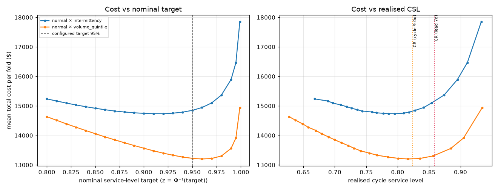

# Cost-optimal service level — 2026-09-18

Configured costs: stockout penalty $5.00/unit, holding 2.0% of unit cost **per day**, lead time 7 days, target 95%. Mean unit cost (training-window price) $5.91.

## 1. What the critical ratio says

`CR = Cu / (Cu + Co)` is the *realised* cycle service level that minimises expected cost, with `Cu` = stockout penalty per unit and `Co` = `holding_cost_rate × unit_cost × period`, `period` being how long a surplus unit is carried per cycle it protects.

| period used for Co | days | CR at mean price |
| --- | --- | --- |
| lead time (shortest possible cycle; upper bound on CR) | 7 | 85.8% |
| measured mean cycle (series-days per order, target 95%) | 9.0 | 82.4% |

Because `Co` scales with price, CR is a per-SKU quantity. Across the 400 series (measured cycle length), CR runs p10 68.3% / p25 77.3% / **median 86.9%** / p75 93.4% / p90 97.5%: cheap SKUs justify near-universal service, expensive ones a much lower one. **A single uniform target cannot be optimal for all of them** — a separate finding from where the uniform optimum lands.

**Unit check worth confirming:** holding accrues per day, so 2% is ~730% of unit cost per year. If `HOLDING_COST_RATE` was meant as an annual or monthly rate, holding is overpriced by 30–365× and every optimum here is biased *downward*. The parameter is used as configured (Track A costs are declared illustrative in `.env.example`); the direction of the bias is stated so the result is not over-read.

## 2. What the simulation says

Shipped scheme (`normal × intermittency`), nominal target swept 0.80–1.00, means across folds and models:

| target | mean_total_cost | holding_cost | stockout_cost | fill_rate | cycle_service_level | vs_target |
| --- | --- | --- | --- | --- | --- | --- |
| 0.800 | 15236.980 | 4305.626 | 10931.354 | 0.723 | 0.668 | 2.622 |
| 0.810 | 15165.912 | 4440.957 | 10724.955 | 0.729 | 0.689 | 2.143 |
| 0.820 | 15096.038 | 4582.450 | 10513.588 | 0.734 | 0.697 | 1.673 |
| 0.830 | 15031.682 | 4730.516 | 10301.167 | 0.739 | 0.709 | 1.239 |
| 0.840 | 14973.046 | 4885.635 | 10087.410 | 0.745 | 0.719 | 0.844 |
| 0.850 | 14918.730 | 5048.321 | 9870.408 | 0.750 | 0.727 | 0.479 |
| 0.860 | 14869.981 | 5219.635 | 9650.346 | 0.756 | 0.736 | 0.150 |
| 0.870 | 14825.574 | 5400.632 | 9424.942 | 0.762 | 0.743 | -0.149 |
| 0.880 | 14793.026 | 5593.587 | 9199.439 | 0.767 | 0.759 | -0.368 |
| 0.890 | 14765.888 | 5799.748 | 8966.140 | 0.773 | 0.766 | -0.551 |
| 0.900 | 14747.204 | 6021.233 | 8725.972 | 0.779 | 0.777 | -0.677 |
| 0.910 | 14737.244 | 6261.166 | 8476.078 | 0.786 | 0.785 | -0.744 |
| 0.920 | 14734.873 | 6523.408 | 8211.465 | 0.792 | 0.795 | -0.760 |
| 0.930 | 14752.230 | 6814.649 | 7937.581 | 0.799 | 0.810 | -0.643 |
| 0.940 | 14787.754 | 7142.603 | 7645.151 | 0.807 | 0.818 | -0.403 |
| 0.950 | 14847.658 | 7519.438 | 7328.219 | 0.815 | 0.828 | 0.000 |
| 0.960 | 14944.562 | 7965.651 | 6978.911 | 0.823 | 0.842 | 0.653 |
| 0.970 | 15100.273 | 8520.070 | 6580.203 | 0.834 | 0.854 | 1.701 |
| 0.980 | 15366.207 | 9265.166 | 6101.040 | 0.846 | 0.874 | 3.492 |
| 0.990 | 15894.706 | 10454.060 | 5440.646 | 0.862 | 0.895 | 7.052 |
| 0.995 | 16465.911 | 11553.385 | 4912.526 | 0.876 | 0.911 | 10.899 |
| 0.999 | 17846.488 | 13845.036 | 4001.452 | 0.899 | 0.933 | 20.197 |

`vs_target` = % change in cost relative to the configured target's row.

Cost is minimised at a nominal target of **92%** ($14,735/fold), +0.8% vs. the configured 95% ($14,848). Realised CSL there is 79.5%, fill rate 79.2%.

**Compare on the right axis.** The critical ratio is a statement about realised CSL (82.4% at the mean price, 86.9% median across SKUs); the shipped policy at the configured 95% target already *realises* 82.8%. Against the realised axis the 'gap' the project has been describing is far smaller than 12 points — see the verdict.

## 3. Verdict (branches fixed in advance)

**Optimum below the target, but not by a wide margin** (92% vs 95%, 3 points). Neither pre-registered branch fires cleanly; the curve is U-shaped, so nothing looks like a pricing bug, and the target is mildly too high for these costs.

The curve is flat near its minimum: within ±3 points of nominal target the cost stays within 0.8% of the minimum, so the argmin itself is not sharply determined and should be read as a region, not a number.

## 4. Does the optimum depend on the calibration scheme?

Same sweep on the ablation's best cell (`normal × volume_quintile`): minimum at a nominal **96%** ($13,201/fold, realised CSL 81.6%); at the configured 95% it costs $13,223.

| target | mean_total_cost | fill_rate | cycle_service_level |
| --- | --- | --- | --- |
| 0.800 | 14634.211 | 0.725 | 0.627 |
| 0.810 | 14512.769 | 0.731 | 0.638 |
| 0.820 | 14393.359 | 0.737 | 0.649 |
| 0.830 | 14278.142 | 0.743 | 0.657 |
| 0.840 | 14166.468 | 0.749 | 0.670 |
| 0.850 | 14056.880 | 0.755 | 0.679 |
| 0.860 | 13949.999 | 0.761 | 0.690 |
| 0.870 | 13849.235 | 0.767 | 0.700 |
| 0.880 | 13751.250 | 0.774 | 0.711 |
| 0.890 | 13657.282 | 0.780 | 0.721 |
| 0.900 | 13565.956 | 0.787 | 0.731 |
| 0.910 | 13477.780 | 0.794 | 0.741 |
| 0.920 | 13398.731 | 0.802 | 0.755 |
| 0.930 | 13328.207 | 0.810 | 0.767 |
| 0.940 | 13267.309 | 0.818 | 0.785 |
| 0.950 | 13223.213 | 0.827 | 0.801 |
| 0.960 | 13201.154 | 0.837 | 0.816 |
| 0.970 | 13218.941 | 0.848 | 0.835 |
| 0.980 | 13301.682 | 0.862 | 0.856 |
| 0.990 | 13559.060 | 0.880 | 0.885 |
| 0.995 | 13915.266 | 0.894 | 0.905 |
| 0.999 | 14935.811 | 0.918 | 0.934 |

## 5. Is cost-down-with-CSL-down a pricing bug? No: compare at matched service

Cost falling while CSL falls looks impossible in a simulation that prices stockouts. Along a single scheme's target axis it *is* impossible, and the tables above show it: realised CSL rises monotonically with the target while cost is U-shaped. Across schemes it is not, because CSL counts every replenishment cycle equally while cost counts lost units and their price — a scheme that moves buffer toward high-volume SKUs cuts cost and CSL together. The test that separates that from a bug is to raise the finer scheme's target until its realised CSL is at least the baseline's and see whether it is still cheaper. The target is picked by that service criterion (the smallest grid target that matches baseline CSL), not by minimising cost.

`normal × volume_quintile` at nominal **97%** (realised CSL 83.5%, fill rate 84.8%) vs. the shipped `normal × intermittency` at 95% (CSL 82.8%, fill rate 81.5%). Paired bootstrap over series, 2,000 resamples, fine minus baseline:

- **Cost**: $-1,628.7 [$-2,247.2, $-1,079.1] per fold
- **Cycle service level**: +0.7pp [-0.6pp, 2.1pp] — crosses zero
- **Fill rate**: +3.3pp [1.9pp, 4.9pp]

**At matched service the finer scheme is still cheaper, with cycle service level not distinguishably different and fill rate better (CI excludes zero).** The cost/CSL trade-off in the ablation was an artefact of comparing the two schemes at the same *nominal* target, where they realise different service. There is no pricing bug, and no trade-off to adjudicate: the finer scheme at a slightly higher nominal target is cheaper, matches on CSL and is no worse on fill rate.

One caveat: the matched target is read off the same folds it is then evaluated on. It is one parameter chosen from a 20-point grid by a service criterion, so the optimism is small, but a fresh time window would be the clean test.
