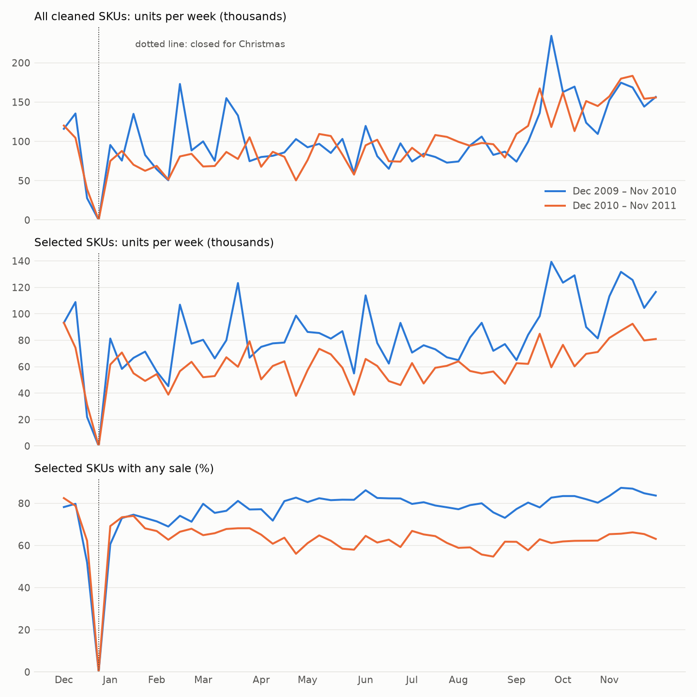

# Track B cleaning — UCI Online Retail II — 2026-09-29

Data: Chen, D. (2012). Online Retail II [Dataset]. UCI Machine Learning Repository. https://doi.org/10.24432/C5CG6D. Licence CC BY 4.0. A UK online seller of gift-ware with many wholesale customers; 2009-12-01 to 2011-12-09.

Nothing here has run a model. This is the state of the data the models will see.

## What each cleaning rule removed

Input: 1,067,371 rows. Units are counted where the rule removed them; a rule that removes sales and returns lists both.

| rule | rows removed | sold units | returned units | detail |
| --- | --- | --- | --- | --- |
| stock codes normalised (whitespace trimmed, upper-cased) | 0 | 0 | 0 | 3,472 rows changed; 174 codes merged into another spelling |
| sheet overlap: the same 2010-12-01..09 rows in both sheets, kept once | 22,523 | 182,448 | 15,800 |  |
| non-product stock codes (postage, fees, adjustments, vouchers, tests) | 5,992 | 25,002 | 14,367 |  |
| negative quantity that is not a cancellation (stock write-offs) | 3,362 | 0 | 564,030 |  |
| zero or negative price | 2,576 | 243,450 | 0 |  |
| cancellations netted against the customer's earlier sale of the same SKU (90 days) | 23,581 | 432,448 | 469,881 |  |
| partial first and last weeks (outside the 104 complete weeks) | 31,422 | 306,054 | 0 |  |

Cancellations: 17,973 rows, 469,881 units; 432,448 (92.0%) reversed a sale by the same customer of the same SKU in the previous 90 days and were netted against it, 37,433 could not be matched and were dropped.

## Series selection (fixed before any model was run)

A SKU is kept if it sold in at least 26 of the first 52 weeks. Of 4,667 SKUs that sold at least once in the 104 weeks, **1,742 qualify**. For context only, the same count at 13 weeks is 2,666 and at 39 weeks is 942. The selected SKUs carry 71.8% of the cleaned units. The rule looks only at year one, so a SKU first sold in year two cannot be selected: launches are out of scope, which is a limitation and a source of selection bias (survivors are steadier than the catalogue).

Panel: 1,742 series × 104 weeks (2009-12-07 to 2011-11-28, weeks start Monday), 181,168 rows. Weeks with no trading at all (Christmas closure): 2009-12-28, 2010-12-27.

## Zero share

| scope | share of SKU-weeks with no sale |
| --- | --- |
| all 104 weeks | 30.1% |
| excluding the closed weeks | 28.8% |
| year 1 (first 52 weeks) | 23.2% |
| year 2 | 37.1% |

Across SKUs the open-week zero share has quartiles 10% / 25% / 45%. 371 of the 1,742 selected SKUs sold nothing in the final 13 weeks (discontinued or stocked out; the data cannot tell which). When a SKU does sell in a week, the mean is 59 units and the median 17. Track A's daily zero share is 77%, so this is intermittent at a different grain: weekly aggregation removed most of the zeros, and what is left is lumpier per non-zero period.

## Seasonality, and what the selection rule does to it

Year 2 as a share of year 1: 94% of units company-wide, 73% for the selected SKUs, 184% for the SKUs the rule leaves out. The Sep-Nov to Mar-Jul ratio is 1.34 for the selected SKUs against 3.77 for the rest (year 1). By construction the rule keeps SKUs that sold across most of year 1 and cannot select a SKU first sold in year 2, so it drops short-season and new products.

| group | units, year 1 | units, year 2 | year 2 / year 1 | Sep-Nov / Mar-Jul, year 1 | Sep-Nov / Mar-Jul, year 2 |
| --- | --- | --- | --- | --- | --- |
| all cleaned SKUs (4,667) | 5,397,400 | 5,085,768 | 0.94 | 1.61 | 1.73 |
| selected (1,742) | 4,354,147 | 3,170,036 | 0.73 | 1.34 | 1.28 |
| not selected (2,925) | 1,043,253 | 1,915,732 | 1.84 | 3.77 | 2.70 |

652 SKUs sold for the first time in year 2 and carry 19.3% of year-2 units. The rule also guarantees year-1 activity and nothing after it, so the selected panel's zero share rises from year 1 to year 2 partly by construction.

## Bulk orders

Wholesale customers place very large orders. After cancellations are netted (which removes the two largest lines in the file, 80,995 and 74,215 units, each cancelled by the same customer within minutes), the largest surviving SKU-weeks are:

| SKU | item | week of | units | x SKU's typical week | largest line | invoice lines |
| --- | --- | --- | --- | --- | --- | --- |
| 21982 | Pack Of 12 Suki Tissues  | 2010-03-22 | 11,414 | 113x | 10,000 | 13 |
| 17003 | Brocade Ring Purse  | 2010-08-30 | 11,174 | 38x | 7,128 | 5 |
| 21984 | Pack Of 12 Pink Paisley Tissues  | 2010-03-22 | 11,109 | 179x | 10,000 | 6 |
| 21981 | Pack Of 12 Woodland Tissues  | 2010-03-22 | 10,696 | 127x | 10,000 | 14 |
| 21980 | Pack Of 12 Red Retrospot Tissues  | 2010-03-22 | 10,070 | 84x | 10,000 | 6 |
| 17003 | Brocade Ring Purse  | 2010-11-01 | 6,816 | 23x | 6,336 | 8 |
| 84879 | Assorted Colour Bird Ornament | 2010-11-08 | 5,584 | 9x | 2,880 | 63 |
| 84077 | World War 2 Gliders Asstd Designs | 2010-11-01 | 5,349 | 7x | 4,320 | 19 |
| 84077 | World War 2 Gliders Asstd Designs | 2011-10-24 | 5,328 | 7x | 4,800 | 12 |
| 21982 | Pack Of 12 Suki Tissues  | 2010-05-17 | 5,247 | 52x | 5,000 | 14 |
| 21985 | Pack Of 12 Hearts Design Tissues  | 2010-05-17 | 5,007 | 38x | 5,000 | 5 |
| 37340 | Multicolour Spring Flower Mug | 2010-09-27 | 4,992 | 384x | 4,992 | 1 |

The largest surviving single invoice lines:

| SKU | item | date | units | country | unit price (GBP) |
| --- | --- | --- | --- | --- | --- |
| 21984 | Pack Of 12 Pink Paisley Tissues  | 2010-03-23 | 10,000 | United Kingdom | 0.25 |
| 21980 | Pack Of 12 Red Retrospot Tissues  | 2010-03-23 | 10,000 | United Kingdom | 0.25 |
| 21981 | Pack Of 12 Woodland Tissues  | 2010-03-23 | 10,000 | United Kingdom | 0.25 |
| 21982 | Pack Of 12 Suki Tissues  | 2010-03-23 | 10,000 | United Kingdom | 0.25 |
| 17003 | Brocade Ring Purse  | 2010-09-03 | 7,128 | United Kingdom | 0.19 |
| 17003 | Brocade Ring Purse  | 2010-11-04 | 6,336 | United Kingdom | 0.19 |
| 21985 | Pack Of 12 Hearts Design Tissues  | 2010-05-18 | 5,000 | United Kingdom | 0.50 |
| 21982 | Pack Of 12 Suki Tissues  | 2010-05-18 | 5,000 | United Kingdom | 0.50 |
| 37340 | Multicolour Spring Flower Mug | 2010-09-27 | 4,992 | United Kingdom | 0.10 |
| 84077 | World War 2 Gliders Asstd Designs | 2011-10-27 | 4,800 | United Kingdom | 0.21 |

The top 1% of non-zero SKU-weeks hold 19.3% of all units, and invoice lines of 1,000 units or more account for 5.4%. These are kept as demand: they are the business, and removing them would be choosing a smoother company than the one in the data.
